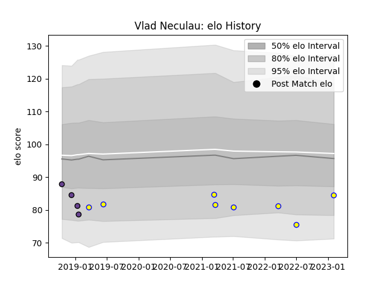

---  
layout: page  
title: Vlad Neculau  
date: 2023-02-04 18:29:28.270259  
categories: player  
---
# Vlad Neculau

## Positions: FL

## Country: Romania

## Current elo: 85.0

## Current Percentile: 8.0

# Elo History

# Match History

| Team               |   Appearances |   Win Rate |
|:-------------------|--------------:|-----------:|
| Romania            |             8 |       0.75 |
| Timisoara Saracens |             4 |       0    |

| Opponent           |   Matches |   Win Rate |
|:-------------------|----------:|-----------:|
| Dragons            |         2 |          0 |
| Argentina          |         1 |          0 |
| Belgium            |         1 |          1 |
| Chile              |         1 |          1 |
| Clermont Auvergne  |         1 |          0 |
| Italy              |         1 |          0 |
| Netherlands        |         1 |          1 |
| Northampton Saints |         1 |          0 |
| Poland             |         1 |          1 |
| Portugal           |         1 |          1 |
| Spain              |         1 |          1 |