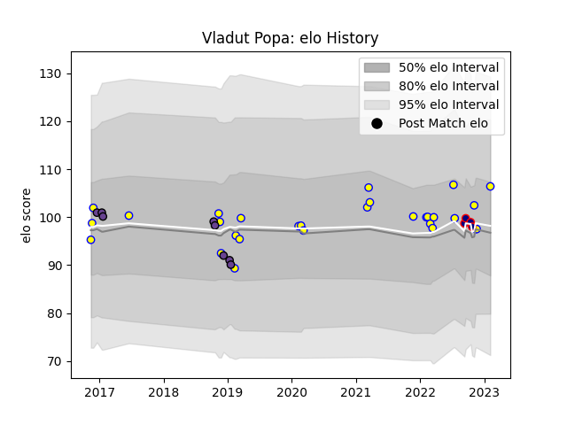

---  
layout: page  
title: Vladut Popa  
date: 2022-11-22 11:45:22.242876  
categories: player  
---
# Vladut Popa

## Positions: C, FH

## Country: Romania

## Current elo: 85.0

## Current Percentile: 13.0

# Elo History

# Match History

| Team               |   Appearances |   Win Rate |
|:-------------------|--------------:|-----------:|
| Romania            |            20 |       0.65 |
| Timisoara Saracens |             8 |       0    |

| Opponent             |   Matches |   Win Rate |
|:---------------------|----------:|-----------:|
| Uruguay              |         5 |        0.4 |
| Portugal             |         2 |        1   |
| Clermont Auvergne    |         2 |        0   |
| Dragons              |         2 |        0   |
| Spain                |         2 |        0.5 |
| Russia               |         2 |        0.5 |
| Canada               |         2 |        1   |
| Tonga                |         1 |        1   |
| Stade Francais Paris |         1 |        0   |
| Samoa                |         1 |        0   |
| Belgium              |         1 |        1   |
| Northampton Saints   |         1 |        0   |
| Harlequins           |         1 |        0   |
| Germany              |         1 |        1   |
| Georgia              |         1 |        0   |
| Edinburgh            |         1 |        0   |
| Chile                |         1 |        1   |
| Netherlands          |         1 |        1   |