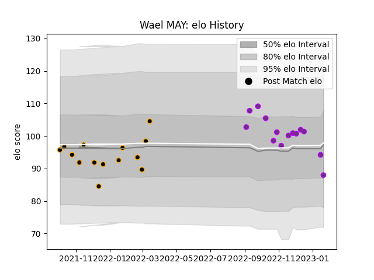

---  
layout: page  
title: Wael MAY  
date: 2023-01-17 11:30:26.294838  
categories: player  
---
# Wael MAY

## Positions: FL, L

## Current elo: 94.0

## Current Percentile: 62.0

# Elo History

# Match History

| Team        |   Appearances |   Win Rate |
|:------------|--------------:|-----------:|
| Chambery    |            14 |   0.5      |
| US Bressane |            13 |   0.615385 |

| Opponent                   |   Matches |   Win Rate |
|:---------------------------|----------:|-----------:|
| Blagnac                    |         3 |   0.666667 |
| Bourgoin-Jallieu           |         3 |   0.666667 |
| Albi                       |         2 |   0        |
| Chambery                   |         2 |   0.5      |
| Dax                        |         2 |   0        |
| Nice                       |         2 |   0.5      |
| Soyaux-Angouleme           |         2 |   1        |
| Suresnes                   |         2 |   1        |
| Tarbes                     |         2 |   1        |
| Valence Romans Drome Rugby |         2 |   0.5      |
| Aubenas                    |         1 |   0        |
| Cognac Saint Jean d'Angély |         1 |   1        |
| Massy                      |         1 |   0        |
| Narbonne                   |         1 |   0        |
| Rennes                     |         1 |   1        |