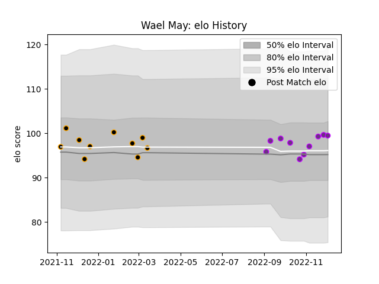

---  
layout: page  
title: Wael May  
date: 2022-11-22 11:26:43.358143  
categories: player  
---
# Wael May

## Positions: FL, L

## Current elo: 99.0

## Current Percentile: 57.0

# Elo History

# Match History

| Team        |   Appearances |   Win Rate |
|:------------|--------------:|-----------:|
| Chambery    |            10 |       0.5  |
| US Bressane |             8 |       0.75 |

| Opponent                   |   Matches |   Win Rate |
|:---------------------------|----------:|-----------:|
| Bourgoin-Jallieu           |         3 |   0.666667 |
| Blagnac                    |         2 |   0.5      |
| Nice                       |         2 |   0.5      |
| Suresnes                   |         2 |   1        |
| Albi                       |         1 |   0        |
| Chambery                   |         1 |   1        |
| Cognac Saint Jean d'Angély |         1 |   1        |
| Dax                        |         1 |   0        |
| Massy                      |         1 |   0        |
| Narbonne                   |         1 |   0        |
| Rennes                     |         1 |   1        |
| Soyaux-Angouleme           |         1 |   1        |
| Tarbes                     |         1 |   1        |