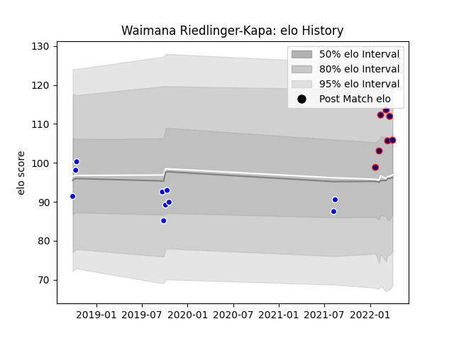

---  
layout: page  
title: Waimana Riedlinger-Kapa  
date: 2023-02-26 11:18:05.312823  
categories: player  
---
# Waimana Riedlinger-Kapa

## Positions: FL, N8

## Current elo: 106.0

## Current Percentile: 82.0

# Elo History

# Match History

| Team                     |   Appearances |   Win Rate |
|:-------------------------|--------------:|-----------:|
| Auckland                 |            10 |   0.5      |
| Hanazono Kintetsu Liners |             7 |   0.857143 |

| Opponent             |   Matches |   Win Rate |
|:---------------------|----------:|-----------:|
| Tasman               |         3 |          0 |
| Hino Red Dolphins    |         2 |          1 |
| Mie Honda Heat       |         2 |          1 |
| Skyactivs Hiroshima  |         2 |          1 |
| Southland            |         2 |          1 |
| Canterbury           |         1 |          1 |
| Mitsubishi Dynaboars |         1 |          0 |
| North Harbour        |         1 |          1 |
| Otago                |         1 |          0 |
| Taranaki             |         1 |          1 |
| Wellington           |         1 |          0 |