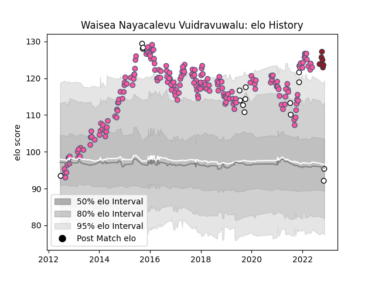

---  
layout: page  
title: Waisea Nayacalevu Vuidravuwalu  
date: 2023-02-02 18:57:40.975262  
categories: player  
---
# Waisea Nayacalevu Vuidravuwalu

## Positions: C, W

## Country: Fiji

## Current elo: 85.0

## Current Percentile: 93.0

# Elo History

# Match History

| Team                 |   Appearances |   Win Rate |
|:---------------------|--------------:|-----------:|
| Stade Francais Paris |           200 |   0.5275   |
| Fiji                 |            19 |   0.394737 |
| Toulon               |             8 |   0.75     |

| Opponent                 |   Matches |   Win Rate |
|:-------------------------|----------:|-----------:|
| Clermont Auvergne        |        17 |   0.382353 |
| Racing 92                |        15 |   0.533333 |
| Toulon                   |        14 |   0.428571 |
| Pau                      |        13 |   0.615385 |
| Bordeaux Begles          |        13 |   0.384615 |
| Brive                    |        13 |   0.615385 |
| Montpellier Herault      |        12 |   0.375    |
| Stade Toulousain         |        12 |   0.458333 |
| Castres Olympique        |        11 |   0.727273 |
| La Rochelle              |        10 |   0.5      |
| Grenoble                 |         9 |   0.555556 |
| Bayonne                  |         9 |   0.555556 |
| Lyon                     |         9 |   0.333333 |
| Perpignan                |         7 |   0.857143 |
| Agen                     |         7 |   0.714286 |
| Oyonnax                  |         6 |   0.5      |
| Biarritz Olympique       |         4 |   0.75     |
| Edinburgh                |         3 |   0.333333 |
| Leicester Tigers         |         3 |   0.333333 |
| Benetton Treviso         |         3 |   0.666667 |
| London Irish             |         2 |   0.5      |
| Wales                    |         2 |   0        |
| New Zealand Maori        |         2 |   0.5      |
| New Zealand              |         2 |   0        |
| Munster                  |         2 |   0.5      |
| Bath Rugby               |         2 |   1        |
| Harlequins               |         2 |   0.5      |
| Scotland                 |         2 |   0        |
| Georgia                  |         2 |   0.75     |
| Australia                |         2 |   0        |
| United States of America |         1 |   1        |
| Spain                    |         1 |   1        |
| Timisoara Saracens       |         1 |   1        |
| Tonga                    |         1 |   1        |
| Leinster                 |         1 |   0        |
| Ospreys                  |         1 |   1        |
| Mont-de-Marsan           |         1 |   1        |
| Lusitanos XV             |         1 |   1        |
| London Welsh             |         1 |   1        |
| Krasny Yar               |         1 |   1        |
| Japan                    |         1 |   1        |
| Ireland                  |         1 |   0        |
| Gloucester Rugby         |         1 |   1        |
| England                  |         1 |   0        |
| Canada                   |         1 |   1        |
| Bristol Rugby            |         1 |   0        |
| Zebre                    |         1 |   1        |