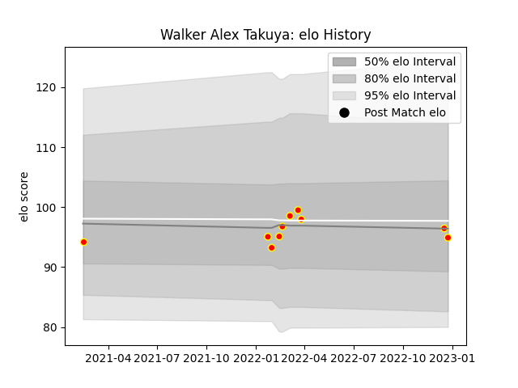

---  
layout: page  
title: Walker Alex Takuya  
date: 2023-03-21 18:15:10.683612  
categories: player  
---
# Walker Alex Takuya

Last updated: 2023-03-21
## Positions: N8

## Current elo: 85.0

## Current Percentile: 32.0

# Elo History

# Match History

| Team          |   Appearances |   Win Rate |
|:--------------|--------------:|-----------:|
| Kyuden Voltex |            15 |   0.533333 |

| Opponent                         |   Matches |   Win Rate |
|:---------------------------------|----------:|-----------:|
| Chugoku Red Regulions            |         3 |        1   |
| Kurita Water Gush                |         3 |        1   |
| Toyota Industries Shuttles Aichi |         3 |        0   |
| Munakata Sanix Blues             |         2 |        0   |
| Shimizu Blue Sharks              |         2 |        0.5 |
| NTT Docomo Red Hurricanes Osaka  |         1 |        0   |
| Skyactivs Hiroshima              |         1 |        1   |