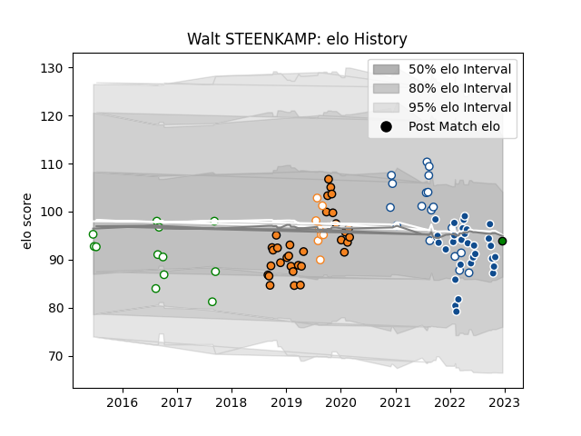

---  
layout: page  
title: Walt STEENKAMP  
date: 2023-03-29 11:32:01.296252  
categories: player  
---
# Walt STEENKAMP

Last updated: 2023-03-29
## Positions: L

## Current elo: 94.0

## Current Percentile: 35.0

# Elo History

# Match History

| Team                 |   Appearances |   Win Rate |
|:---------------------|--------------:|-----------:|
| Cheetahs             |            32 |   0.453125 |
| Bulls                |            31 |   0.645161 |
| Blue Bulls           |            18 |   0.777778 |
| Leopards             |            12 |   0.791667 |
| Free State Cheetahs  |             8 |   0.75     |
| Mitsubishi Dynaboars |             1 |   1        |

| Opponent               |   Matches |   Win Rate |
|:-----------------------|----------:|-----------:|
| Natal Sharks           |         6 |   0.5      |
| Lions                  |         5 |   1        |
| Griquas                |         5 |   0.8      |
| Southern Kings         |         5 |   1        |
| Pumas                  |         5 |   0.8      |
| Munster                |         5 |   0.4      |
| Glasgow Warriors       |         5 |   0.4      |
| Ulster                 |         4 |   0.625    |
| Stormers               |         4 |   0        |
| Sharks                 |         4 |   0.5      |
| Ospreys                |         4 |   0.5      |
| Zebre                  |         4 |   0.75     |
| Cardiff Blues          |         4 |   0.5      |
| Connacht               |         4 |   0.25     |
| Golden Lions           |         4 |   0.75     |
| Griffons               |         3 |   0.666667 |
| Dragons                |         3 |   0.666667 |
| Western Province       |         3 |   1        |
| Valke                  |         3 |   1        |
| Scarlets               |         3 |   0.333333 |
| Benetton Treviso       |         3 |   1        |
| Edinburgh              |         3 |   0.333333 |
| Free State Cheetahs    |         3 |   0.666667 |
| Leinster               |         3 |   0.333333 |
| Namibia Welwitchias    |         2 |   1        |
| Eastern Province Kings |         1 |   1        |
| Border Bulldogs        |         1 |   1        |
| Blue Bulls             |         1 |   1        |
| Black Rams Tokyo       |         1 |   1        |
| SWD Eagles             |         1 |   0.5      |