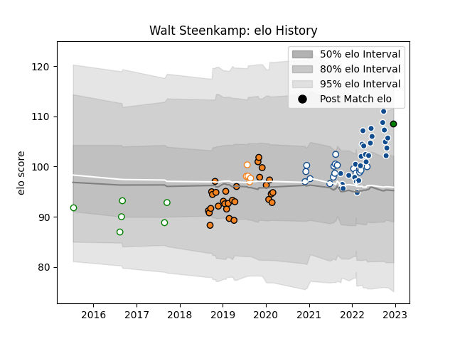

---  
layout: page  
title: Walt Steenkamp  
date: 2022-12-18 16:18:01.277542  
categories: player  
---
# Walt Steenkamp

## Positions: L

## Current elo: 109.0

## Current Percentile: 81.0

# Elo History

# Match History

| Team                 |   Appearances |   Win Rate |
|:---------------------|--------------:|-----------:|
| Cheetahs             |            29 |   0.396552 |
| Bulls                |            28 |   0.642857 |
| Blue Bulls           |            16 |   0.75     |
| Leopards             |             6 |   0.916667 |
| Free State Cheetahs  |             5 |   0.8      |
| Mitsubishi Dynaboars |             1 |   1        |

| Opponent            |   Matches |   Win Rate |
|:--------------------|----------:|-----------:|
| Southern Kings      |         5 |   1        |
| Zebre               |         4 |   0.75     |
| Munster             |         4 |   0.25     |
| Cardiff Blues       |         4 |   0.5      |
| Connacht            |         4 |   0.25     |
| Sharks              |         4 |   0.5      |
| Glasgow Warriors    |         4 |   0.25     |
| Pumas               |         4 |   0.75     |
| Griquas             |         4 |   1        |
| Ospreys             |         4 |   0.5      |
| Western Province    |         3 |   1        |
| Ulster              |         3 |   0.5      |
| Stormers            |         3 |   0        |
| Scarlets            |         3 |   0.333333 |
| Natal Sharks        |         3 |   0.333333 |
| Benetton Treviso    |         3 |   1        |
| Leinster            |         3 |   0.333333 |
| Golden Lions        |         3 |   0.666667 |
| Free State Cheetahs |         3 |   0.666667 |
| Edinburgh           |         3 |   0.333333 |
| Dragons             |         3 |   0.666667 |
| Lions               |         3 |   1        |
| Griffons            |         2 |   1        |
| Namibia Welwitchias |         1 |   1        |
| Black Rams Tokyo    |         1 |   1        |
| SWD Eagles          |         1 |   0.5      |
| Border Bulldogs     |         1 |   1        |
| Valke               |         1 |   1        |
| Blue Bulls          |         1 |   1        |