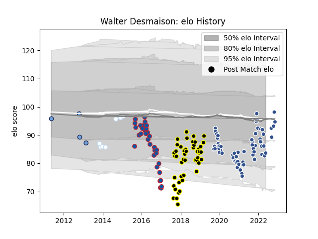

---  
layout: page  
title: Walter Desmaison  
date: 2023-02-24 02:30:20.282194  
categories: player  
---
# Walter Desmaison

## Positions: P

## Current elo: 84.0

## Current Percentile: 32.0

# Elo History

# Match History

| Team           |   Appearances |   Win Rate |
|:---------------|--------------:|-----------:|
| Agen           |            63 |   0.214286 |
| Mont-de-Marsan |            48 |   0.572917 |
| Grenoble       |            32 |   0.34375  |
| Racing 92      |             9 |   0.444444 |
| Bayonne        |             4 |   0.5      |

| Opponent             |   Matches |   Win Rate |
|:---------------------|----------:|-----------:|
| Bayonne              |         9 |   0.5      |
| Stade Toulousain     |         7 |   0.142857 |
| Clermont Auvergne    |         7 |   0        |
| Stade Francais Paris |         6 |   0.5      |
| Beziers              |         6 |   0.5      |
| Brive                |         6 |   0.416667 |
| Colomiers            |         6 |   0.5      |
| Provence Rugby       |         5 |   0.4      |
| La Rochelle          |         5 |   0.4      |
| Vannes               |         5 |   0.6      |
| Grenoble             |         5 |   0.2      |
| Montpellier Herault  |         5 |   0.2      |
| Racing 92            |         5 |   0.1      |
| Aurillac             |         5 |   0.4      |
| Carcassonne          |         5 |   0.8      |
| Biarritz Olympique   |         5 |   0.4      |
| Montauban            |         5 |   0.6      |
| Soyaux-Angouleme     |         4 |   0.25     |
| Lyon                 |         4 |   0        |
| Bordeaux Begles      |         4 |   0        |
| Castres Olympique    |         4 |   0.25     |
| Oyonnax              |         3 |   0.666667 |
| Ospreys              |         3 |   0.166667 |
| Perpignan            |         3 |   0.666667 |
| Pau                  |         3 |   0.333333 |
| Toulon               |         3 |   0        |
| Agen                 |         3 |   1        |
| US Bressane          |         3 |   0        |
| Narbonne             |         3 |   0.333333 |
| Mont-de-Marsan       |         3 |   0.333333 |
| Edinburgh            |         2 |   0        |
| Dax                  |         2 |   1        |
| London Irish         |         2 |   0.5      |
| Rouen                |         2 |   0.5      |
| Benetton Treviso     |         2 |   0.5      |
| Massy                |         2 |   0.5      |
| Mogliano             |         1 |   1        |
| Nevers               |         1 |   1        |
| Harlequins           |         1 |   0        |
| Wasps                |         1 |   0        |