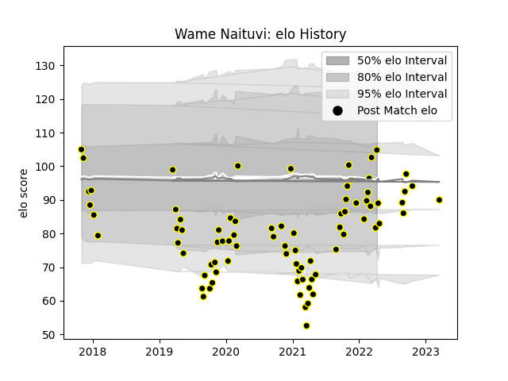

---  
layout: page  
title: Wame Naituvi  
date: 2023-03-21 18:00:08.541844  
categories: player  
---
# Wame Naituvi

Last updated: 2023-03-21
## Positions: W, FB

## Current elo: 105.0

## Current Percentile: 17.0

# Elo History

# Match History

| Team           |   Appearances |   Win Rate |
|:---------------|--------------:|-----------:|
| Mont-de-Marsan |            80 |     0.5625 |

| Opponent                   |   Matches |   Win Rate |
|:---------------------------|----------:|-----------:|
| Beziers                    |         7 |   0.571429 |
| Vannes                     |         6 |   0.166667 |
| Aurillac                   |         6 |   0.833333 |
| Colomiers                  |         5 |   0.4      |
| Soyaux-Angouleme           |         5 |   0.4      |
| Rouen                      |         5 |   1        |
| Oyonnax                    |         5 |   0.5      |
| Montauban                  |         5 |   0.4      |
| Carcassonne                |         5 |   0.4      |
| Nevers                     |         4 |   0.5      |
| Perpignan                  |         4 |   0.5      |
| Provence Rugby             |         3 |   0.666667 |
| Biarritz Olympique         |         3 |   0.666667 |
| Bayonne                    |         3 |   1        |
| Agen                       |         3 |   0.666667 |
| Grenoble                   |         2 |   0        |
| Massy                      |         2 |   1        |
| Narbonne                   |         2 |   0.5      |
| US Bressane                |         2 |   1        |
| Valence Romans Drome Rugby |         2 |   0.75     |
| Brive                      |         1 |   0        |