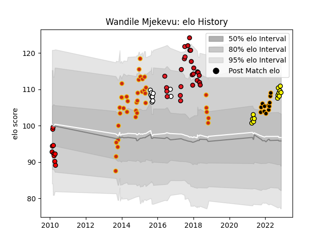

---  
layout: page  
title: Wandile Mjekevu  
date: 2023-02-15 22:14:55.058340  
categories: player  
---
# Wandile Mjekevu

## Positions: W, C

## Current elo: 98.0

## Current Percentile: 27.0

# Elo History

# Match History

| Team             |   Appearances |   Win Rate |
|:-----------------|--------------:|-----------:|
| Perpignan        |            41 |   0.365854 |
| Albi             |            16 |   0.625    |
| Chambery         |            15 |   0.466667 |
| Stade Toulousain |            15 |   0.433333 |
| Natal Sharks     |            13 |   0.461538 |
| Southern Kings   |            11 |   0.454545 |
| Lions            |            10 |   0        |

| Opponent                   |   Matches |   Win Rate |
|:---------------------------|----------:|-----------:|
| Toulon                     |         5 |   0.2      |
| Bourgoin-Jallieu           |         5 |   0.6      |
| Nice                       |         4 |   0.5      |
| Montpellier Herault        |         4 |   0.5      |
| Tarbes                     |         3 |   0        |
| Golden Lions               |         3 |   0        |
| Stade Francais Paris       |         3 |   0.333333 |
| Albi                       |         3 |   0.333333 |
| Massy                      |         3 |   0        |
| Clermont Auvergne          |         3 |   0        |
| Dax                        |         3 |   0.666667 |
| Eastern Province Kings     |         3 |   1        |
| Narbonne                   |         3 |   0.666667 |
| Jaguares                   |         2 |   1        |
| La Rochelle                |         2 |   0.5      |
| Lyon                       |         2 |   0.5      |
| Highlanders                |         2 |   0        |
| Agen                       |         2 |   0.75     |
| New South Wales Waratahs   |         2 |   0.5      |
| Oyonnax                    |         2 |   0.5      |
| Pau                        |         2 |   0        |
| Pumas                      |         2 |   0.5      |
| Queensland Reds            |         2 |   0        |
| Racing 92                  |         2 |   0.25     |
| Stormers                   |         2 |   0        |
| Valence Romans Drome Rugby |         2 |   0.5      |
| Edinburgh                  |         2 |   0.5      |
| Grenoble                   |         2 |   0.5      |
| Dijon                      |         2 |   1        |
| Castres Olympique          |         2 |   0        |
| Aubenas                    |         2 |   0.5      |
| Bayonne                    |         2 |   0.5      |
| Blagnac                    |         2 |   0.5      |
| Bordeaux Begles            |         2 |   1        |
| Carcassonne                |         2 |   0.5      |
| Bulls                      |         2 |   0.5      |
| Cognac Saint Jean d'Angély |         2 |   1        |
| Chiefs                     |         1 |   0        |
| Colomiers                  |         1 |   0        |
| Western Force              |         1 |   0        |
| Gloucester Rugby           |         1 |   0        |
| Aurillac                   |         1 |   0        |
| Crusaders                  |         1 |   0        |
| Suresnes                   |         1 |   1        |
| Beziers                    |         1 |   1        |
| Stade Toulousain           |         1 |   0        |
| Biarritz Olympique         |         1 |   0        |
| Soyaux-Angouleme           |         1 |   1        |
| Sharks                     |         1 |   0        |
| Sale Sharks                |         1 |   0.5      |
| Rennes                     |         1 |   1        |
| Blue Bulls                 |         1 |   0        |
| Cheetahs                   |         1 |   0        |
| Boland Cavaliers           |         1 |   1        |
| Griquas                    |         1 |   1        |
| Brumbies                   |         1 |   0        |
| Free State Cheetahs        |         1 |   0        |
| Cardiff Blues              |         1 |   0        |
| Carqueiranne-Hyères        |         1 |   0        |
| Montauban                  |         1 |   1        |
| Melbourne Rebels           |         1 |   1        |
| Hurricanes                 |         1 |   0        |
| Chambery                   |         1 |   1        |
| Lions                      |         1 |   0        |
| Western Province           |         1 |   0        |