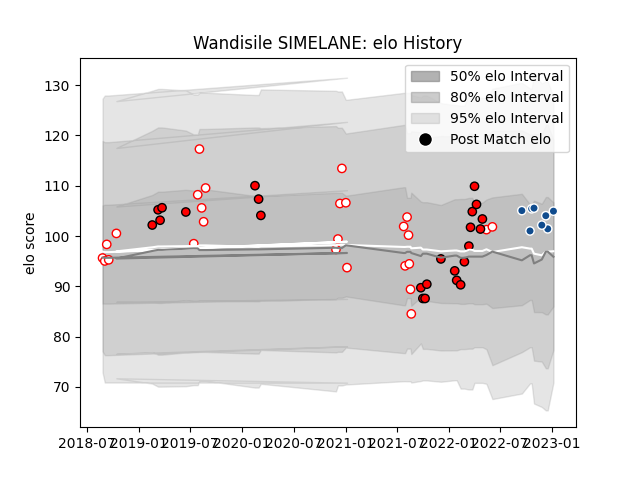

---  
layout: page  
title: Wandisile SIMELANE  
date: 2023-02-24 02:34:51.866783  
categories: player  
---
# Wandisile SIMELANE

## Positions: C

## Current elo: 114.0

## Current Percentile: 83.0

# Elo History

# Match History

| Team         |   Appearances |   Win Rate |
|:-------------|--------------:|-----------:|
| Golden Lions |            29 |   0.568966 |
| Lions        |            25 |   0.44     |
| Bulls        |             4 |   0.75     |

| Opponent                 |   Matches |   Win Rate |
|:-------------------------|----------:|-----------:|
| Blue Bulls               |         7 |   0.142857 |
| Free State Cheetahs      |         5 |   0.7      |
| Griquas                  |         5 |   1        |
| Western Province         |         4 |   0.5      |
| Pumas                    |         4 |   0.75     |
| Natal Sharks             |         4 |   0.5      |
| Bulls                    |         3 |   0        |
| Stormers                 |         3 |   0.333333 |
| Sharks                   |         3 |   0.333333 |
| Benetton Treviso         |         2 |   1        |
| Munster                  |         2 |   0.5      |
| Melbourne Rebels         |         2 |   0.5      |
| Jaguares                 |         2 |   1        |
| Lions                    |         1 |   1        |
| Leinster                 |         1 |   0        |
| New South Wales Waratahs |         1 |   0        |
| Ospreys                  |         1 |   1        |
| Glasgow Warriors         |         1 |   0        |
| Scarlets                 |         1 |   0        |
| Edinburgh                |         1 |   1        |
| Connacht                 |         1 |   0        |
| Sunwolves                |         1 |   1        |
| Ulster                   |         1 |   0        |
| Cardiff Blues            |         1 |   1        |
| Zebre                    |         1 |   1        |