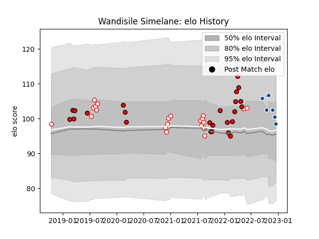

---  
layout: page  
title: Wandisile Simelane  
date: 2022-12-18 16:27:54.549252  
categories: player  
---
# Wandisile Simelane

## Positions: C, FB

## Current elo: 98.0

## Current Percentile: 66.0

# Elo History

# Match History

| Team         |   Appearances |   Win Rate |
|:-------------|--------------:|-----------:|
| Lions        |            24 |   0.458333 |
| Golden Lions |            21 |   0.595238 |
| Bulls        |             7 |   0.714286 |

| Opponent                 |   Matches |   Win Rate |
|:-------------------------|----------:|-----------:|
| Natal Sharks             |         4 |   0.5      |
| Blue Bulls               |         4 |   0        |
| Pumas                    |         4 |   0.75     |
| Stormers                 |         3 |   0.333333 |
| Griquas                  |         3 |   1        |
| Free State Cheetahs      |         3 |   0.833333 |
| Sharks                   |         3 |   0.333333 |
| Western Province         |         3 |   0.666667 |
| Ospreys                  |         2 |   1        |
| Jaguares                 |         2 |   1        |
| Bulls                    |         2 |   0        |
| Melbourne Rebels         |         2 |   0.5      |
| Munster                  |         2 |   0.5      |
| Benetton Treviso         |         2 |   1        |
| Sunwolves                |         1 |   1        |
| Ulster                   |         1 |   0        |
| Scarlets                 |         1 |   0        |
| Lyon                     |         1 |   1        |
| New South Wales Waratahs |         1 |   0        |
| Lions                    |         1 |   1        |
| Leinster                 |         1 |   0        |
| Glasgow Warriors         |         1 |   0        |
| Exeter Chiefs            |         1 |   0        |
| Edinburgh                |         1 |   1        |
| Connacht                 |         1 |   0        |
| Cardiff Blues            |         1 |   1        |
| Zebre                    |         1 |   1        |