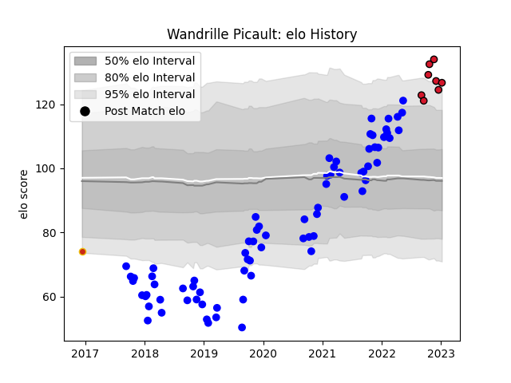

---  
layout: page  
title: Wandrille Picault  
date: 2022-12-18 16:40:01.234586  
categories: player  
---
# Wandrille Picault

## Positions: FL

## Current elo: 95.0

## Current Percentile: 42.0

# Elo History

# Match History

| Team      |   Appearances |   Win Rate |
|:----------|--------------:|-----------:|
| Vannes    |            66 |   0.55303  |
| Oyonnax   |             7 |   0.857143 |
| Perpignan |             1 |   0        |

| Opponent           |   Matches |   Win Rate |
|:-------------------|----------:|-----------:|
| Montauban          |         8 |   0.375    |
| Carcassonne        |         6 |   0.416667 |
| Nevers             |         6 |   0.416667 |
| Beziers            |         5 |   1        |
| Aurillac           |         5 |   0.8      |
| Oyonnax            |         5 |   0.4      |
| Provence Rugby     |         4 |   0.5      |
| Colomiers          |         4 |   0.5      |
| Grenoble           |         4 |   0.75     |
| Mont-de-Marsan     |         4 |   0.5      |
| Biarritz Olympique |         3 |   0.333333 |
| Soyaux-Angouleme   |         3 |   1        |
| Narbonne           |         3 |   0.833333 |
| US Bressane        |         2 |   1        |
| Rouen              |         2 |   0.5      |
| Agen               |         2 |   1        |
| Perpignan          |         2 |   0        |
| Bayonne            |         2 |   0        |
| Massy              |         1 |   1        |
| Roval Drome XV     |         1 |   1        |
| Brive              |         1 |   0        |
| Vannes             |         1 |   1        |