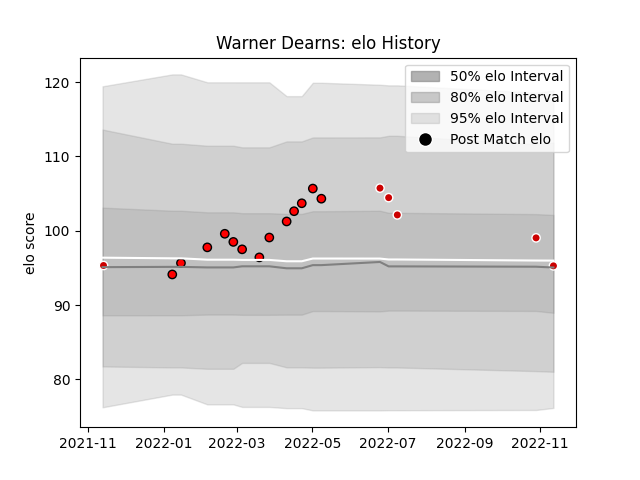

---  
layout: page  
title: Warner Dearns  
date: 2023-03-21 18:38:23.231091  
categories: player  
---
# Warner Dearns

Last updated: 2023-03-21
## Positions: L

## Country: Japan

## Current elo: 98.0

## Current Percentile: 53.0

# Elo History

# Match History

| Team                      |   Appearances |   Win Rate |
|:--------------------------|--------------:|-----------:|
| Toshiba Brave Lupus Tokyo |            16 |   0.5625   |
| Japan                     |             7 |   0.285714 |

| Opponent                          |   Matches |   Win Rate |
|:----------------------------------|----------:|-----------:|
| France                            |         3 |   0        |
| Tokyo Sungoliath                  |         3 |   0.333333 |
| Kubota Spears Funabashi Tokyo-Bay |         2 |   0        |
| NTT Docomo Red Hurricanes Osaka   |         2 |   1        |
| Saitama Wild Knights              |         2 |   0        |
| Shizuoka Blue Revs                |         2 |   1        |
| Black Rams Tokyo                  |         1 |   1        |
| England                           |         1 |   0        |
| Kobelco Kobe Steelers             |         1 |   1        |
| New Zealand                       |         1 |   0        |
| Portugal                          |         1 |   1        |
| Toyota Verblitz                   |         1 |   1        |
| Urayasu D-Rocks                   |         1 |   0        |
| Uruguay                           |         1 |   1        |
| Yokohama Canon Eagles             |         1 |   1        |