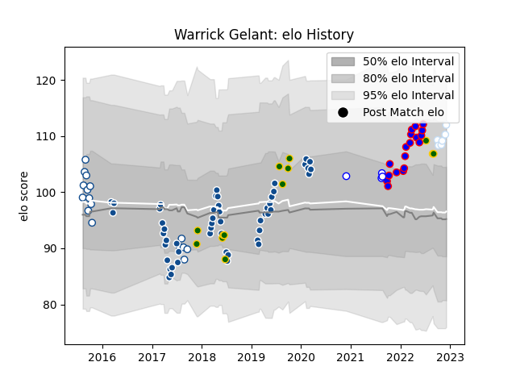

---  
layout: page  
title: Warrick Gelant  
date: 2023-01-13 11:34:43.426993  
categories: player  
---
# Warrick Gelant

## Positions: FB

## Country: South Africa

## Current elo: 93.0

## Current Percentile: 55.0

# Elo History

# Match History

| Team             |   Appearances |   Win Rate |
|:-----------------|--------------:|-----------:|
| Bulls            |            51 |   0.392157 |
| Stormers         |            18 |   0.777778 |
| Blue Bulls       |            16 |   0.625    |
| South Africa     |            13 |   0.615385 |
| Racing 92        |             8 |   0.625    |
| Western Province |             5 |   0.5      |

| Opponent                 |   Matches |   Win Rate |
|:-------------------------|----------:|-----------:|
| Sharks                   |         8 |   0.75     |
| Lions                    |         7 |   0.428571 |
| Stormers                 |         7 |   0.285714 |
| Jaguares                 |         5 |   0.4      |
| Free State Cheetahs      |         4 |   0.75     |
| Golden Lions             |         4 |   0.5      |
| Griquas                  |         4 |   0.75     |
| Sunwolves                |         4 |   0.5      |
| Queensland Reds          |         3 |   0.333333 |
| Highlanders              |         3 |   0.333333 |
| Australia                |         3 |   0.666667 |
| Blues                    |         3 |   0.166667 |
| Pumas                    |         3 |   0.5      |
| Melbourne Rebels         |         3 |   1        |
| Wales                    |         3 |   0        |
| Western Province         |         3 |   0.333333 |
| England                  |         3 |   0.666667 |
| Hurricanes               |         2 |   0        |
| Edinburgh                |         2 |   0.75     |
| Chiefs                   |         2 |   0        |
| Cheetahs                 |         2 |   0.5      |
| Bulls                    |         2 |   1        |
| Brumbies                 |         2 |   0        |
| Ulster                   |         2 |   1        |
| Crusaders                |         2 |   0        |
| Perpignan                |         1 |   1        |
| Pau                      |         1 |   1        |
| Argentina                |         1 |   1        |
| Scarlets                 |         1 |   1        |
| Natal Sharks             |         1 |   1        |
| Southern Kings           |         1 |   0        |
| Toulon                   |         1 |   1        |
| New South Wales Waratahs |         1 |   1        |
| Italy                    |         1 |   1        |
| Namibia                  |         1 |   1        |
| Munster                  |         1 |   0        |
| Montpellier Herault      |         1 |   0        |
| Leinster                 |         1 |   1        |
| La Rochelle              |         1 |   0        |
| Harlequins               |         1 |   0        |
| Glasgow Warriors         |         1 |   1        |
| Eastern Province Kings   |         1 |   1        |
| Dragons                  |         1 |   1        |
| Clermont Auvergne        |         1 |   1        |
| Cardiff Blues            |         1 |   1        |
| Canada                   |         1 |   1        |
| Brive                    |         1 |   1        |
| Blue Bulls               |         1 |   0        |
| Benetton Treviso         |         1 |   0        |
| Zebre                    |         1 |   1        |