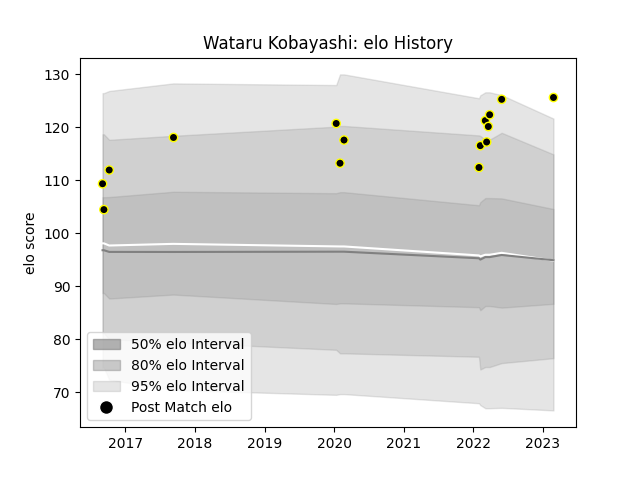

---  
layout: page  
title: Wataru Kobayashi  
date: 2023-02-28 11:09:24.338906  
categories: player  
---
# Wataru Kobayashi

## Positions: L

## Current elo: 126.0

## Current Percentile: 96.0

# Elo History

# Match History

| Team             |   Appearances |   Win Rate |
|:-----------------|--------------:|-----------:|
| Tokyo Sungoliath |            15 |   0.866667 |

| Opponent                          |   Matches |   Win Rate |
|:----------------------------------|----------:|-----------:|
| Black Rams Tokyo                  |         2 |          1 |
| Urayasu D-Rocks                   |         2 |          1 |
| Green Rockets Tokatsu             |         1 |          1 |
| Hino Red Dolphins                 |         1 |          1 |
| Kobelco Kobe Steelers             |         1 |          1 |
| Kubota Spears Funabashi Tokyo-Bay |         1 |          1 |
| Mie Honda Heat                    |         1 |          1 |
| Munakata Sanix Blues              |         1 |          1 |
| NTT Docomo Red Hurricanes Osaka   |         1 |          1 |
| Saitama Wild Knights              |         1 |          0 |
| Shizuoka Blue Revs                |         1 |          1 |
| Toshiba Brave Lupus Tokyo         |         1 |          0 |
| Yokohama Canon Eagles             |         1 |          1 |