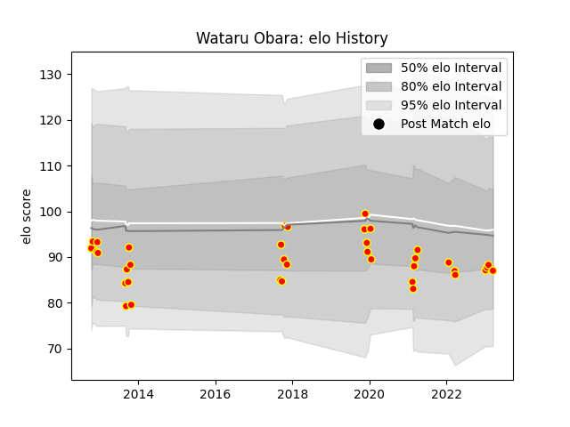

---  
layout: page  
title: Wataru Obara  
date: 2023-03-21 18:45:24.217165  
categories: player  
---
# Wataru Obara

Last updated: 2023-03-21
## Positions: FL, N8

## Current elo: 87.0

## Current Percentile: None

# Elo History

# Match History

| Team          |   Appearances |   Win Rate |
|:--------------|--------------:|-----------:|
| Kyuden Voltex |            37 |   0.405405 |

| Opponent                         |   Matches |   Win Rate |
|:---------------------------------|----------:|-----------:|
| Toyota Industries Shuttles Aichi |         4 |        0   |
| Skyactivs Hiroshima              |         4 |        1   |
| Chugoku Red Regulions            |         3 |        1   |
| Coca-Cola Red Sparks             |         2 |        0   |
| Green Rockets Tokatsu            |         2 |        0   |
| Kamaishi Seawaves                |         2 |        1   |
| Kobelco Kobe Steelers            |         2 |        0   |
| Kurita Water Gush                |         2 |        0.5 |
| Mazda Blue Zoomers               |         2 |        0.5 |
| NTT Docomo Red Hurricanes Osaka  |         2 |        0.5 |
| Black Rams Tokyo                 |         1 |        1   |
| Saitama Wild Knights             |         1 |        0   |
| Toyota Verblitz                  |         1 |        0   |
| Tokyo Sungoliath                 |         1 |        0   |
| Shimizu Blue Sharks              |         1 |        1   |
| Mie Honda Heat                   |         1 |        0   |
| Munakata Sanix Blues             |         1 |        0   |
| Mitsubishi Dynaboars             |         1 |        0   |
| Chubu Electric Power             |         1 |        1   |
| Hino Red Dolphins                |         1 |        0   |
| Hanazono Kintetsu Liners         |         1 |        0   |
| Urayasu D-Rocks                  |         1 |        0   |