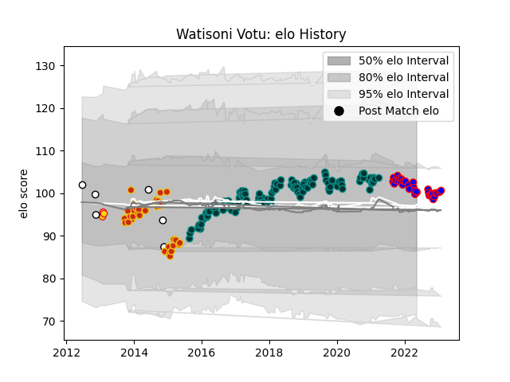

---  
layout: page  
title: Watisoni Votu  
date: 2022-12-18 16:27:10.896271  
categories: player  
---
# Watisoni Votu

## Positions: W, C

## Country: Fiji

## Current elo: 105.0

## Current Percentile: 80.0

# Elo History

# Match History

| Team          |   Appearances |   Win Rate |
|:--------------|--------------:|-----------:|
| Pau           |           120 |   0.4625   |
| Perpignan     |            32 |   0.515625 |
| Beziers       |            28 |   0.446429 |
| Fiji          |             5 |   0.2      |
| Exeter Chiefs |             3 |   0.333333 |

| Opponent                 |   Matches |   Win Rate |
|:-------------------------|----------:|-----------:|
| Montpellier Herault      |        12 |   0.416667 |
| Castres Olympique        |        12 |   0.416667 |
| Brive                    |        10 |   0.4      |
| Lyon                     |         9 |   0.388889 |
| Stade Francais Paris     |         9 |   0.444444 |
| Stade Toulousain         |         9 |   0.333333 |
| Clermont Auvergne        |         9 |   0.222222 |
| La Rochelle              |         8 |   0.25     |
| Racing 92                |         8 |   0.4375   |
| Agen                     |         7 |   1        |
| Toulon                   |         6 |   0.333333 |
| Bordeaux Begles          |         6 |   0.333333 |
| Oyonnax                  |         6 |   0.583333 |
| Bayonne                  |         5 |   0.9      |
| Grenoble                 |         4 |   0.75     |
| Colomiers                |         4 |   0.5      |
| Sale Sharks              |         3 |   0        |
| Provence Rugby           |         3 |   0        |
| Aurillac                 |         3 |   0.5      |
| Carcassonne              |         3 |   0.333333 |
| Vannes                   |         2 |   0        |
| Rouen                    |         2 |   1        |
| Tarbes                   |         2 |   0.5      |
| US Bressane              |         2 |   0        |
| Worcester Warriors       |         2 |   1        |
| Perpignan                |         2 |   1        |
| Munster                  |         2 |   0        |
| Nevers                   |         2 |   0.5      |
| Narbonne                 |         2 |   1        |
| Mont-de-Marsan           |         2 |   0.5      |
| Montauban                |         2 |   1        |
| Gloucester Rugby         |         2 |   0.5      |
| Bath Rugby               |         2 |   0        |
| Beziers                  |         2 |   1        |
| Biarritz Olympique       |         2 |   1        |
| Cardiff Blues            |         2 |   0        |
| Dragons                  |         2 |   0        |
| Zebre                    |         2 |   1        |
| Leicester Tigers         |         2 |   0.5      |
| Massy                    |         2 |   1        |
| Ireland                  |         1 |   0        |
| France                   |         1 |   0        |
| England                  |         1 |   0        |
| Albi                     |         1 |   0        |
| Soyaux-Angouleme         |         1 |   0        |
| Edinburgh                |         1 |   1        |
| Pau                      |         1 |   1        |
| Bristol Rugby            |         1 |   0        |
| United States of America |         1 |   1        |
| Ospreys                  |         1 |   1        |
| Northampton Saints       |         1 |   1        |
| Scotland                 |         1 |   0        |