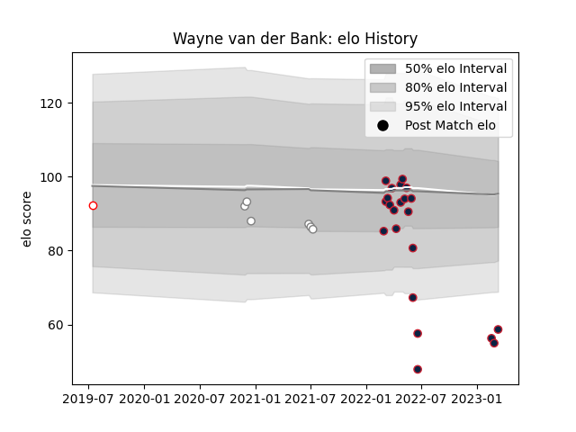

---  
layout: page  
title: Wayne van der Bank  
date: 2023-03-21 18:03:01.700036  
categories: player  
---
# Wayne van der Bank

Last updated: 2023-03-21
## Positions: C

## Current elo: 65.0

## Current Percentile: 2.0

# Elo History

# Match History

| Team                   |   Appearances |   Win Rate |
|:-----------------------|--------------:|-----------:|
| New England Free Jacks |            23 |   0.695652 |
| Pumas                  |             6 |   0.333333 |
| Golden Lions           |             1 |   1        |

| Opponent            |   Matches |   Win Rate |
|:--------------------|----------:|-----------:|
| Rugby New York      |         5 |        0.6 |
| R.U. New York       |         4 |        0.5 |
| NOLA Gold           |         3 |        1   |
| Free State Cheetahs |         2 |        0   |
| Griquas             |         2 |        1   |
| Old Glory DC        |         2 |        1   |
| Rugby ATL           |         2 |        1   |
| Toronto Arrows      |         2 |        0.5 |
| Austin Gilgronis    |         1 |        1   |
| Blue Bulls          |         1 |        0   |
| L. A. Giltinis      |         1 |        0   |
| Natal Sharks        |         1 |        0   |
| Pumas               |         1 |        1   |
| San Diego Legion    |         1 |        0   |
| Seattle Seawolves   |         1 |        1   |
| Utah Warriors       |         1 |        1   |