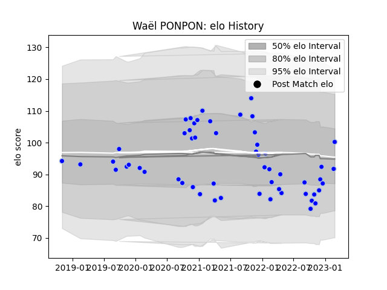

---  
layout: page  
title: Waël PONPON  
date: 2023-02-24 09:51:53.772298  
categories: player  
---
# Waël PONPON

## Positions: FL

## Current elo: 91.0

## Current Percentile: 24.0

# Elo History

# Match History

| Team      |   Appearances |   Win Rate |
|:----------|--------------:|-----------:|
| Colomiers |            54 |   0.527778 |

| Opponent                   |   Matches |   Win Rate |
|:---------------------------|----------:|-----------:|
| Grenoble                   |         6 |   0.666667 |
| Mont-de-Marsan             |         6 |   0.333333 |
| Vannes                     |         5 |   0.4      |
| Provence Rugby             |         5 |   0.8      |
| Aurillac                   |         4 |   0.25     |
| Oyonnax                    |         4 |   0.375    |
| Rouen                      |         3 |   0.666667 |
| Perpignan                  |         3 |   0.333333 |
| Nevers                     |         3 |   1        |
| Carcassonne                |         3 |   0.333333 |
| Beziers                    |         3 |   0.333333 |
| Narbonne                   |         2 |   1        |
| Soyaux-Angouleme           |         2 |   1        |
| Massy                      |         1 |   1        |
| Bayonne                    |         1 |   0        |
| US Bressane                |         1 |   1        |
| Valence Romans Drome Rugby |         1 |   0        |
| Agen                       |         1 |   0        |