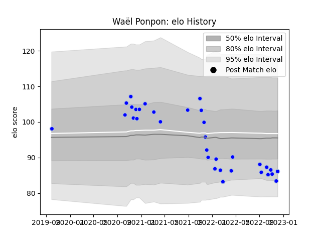

---  
layout: page  
title: Waël Ponpon  
date: 2022-12-18 16:33:44.491953  
categories: player  
---
# Waël Ponpon

## Positions: FL

## Current elo: 87.0

## Current Percentile: 20.0

# Elo History

# Match History

| Team      |   Appearances |   Win Rate |
|:----------|--------------:|-----------:|
| Colomiers |            35 |   0.528571 |

| Opponent         |   Matches |   Win Rate |
|:-----------------|----------:|-----------:|
| Provence Rugby   |         4 |   0.75     |
| Grenoble         |         4 |   0.75     |
| Vannes           |         3 |   0.333333 |
| Rouen            |         3 |   0.666667 |
| Oyonnax          |         3 |   0.166667 |
| Aurillac         |         2 |   0        |
| Soyaux-Angouleme |         2 |   1        |
| Perpignan        |         2 |   0.5      |
| Narbonne         |         2 |   1        |
| Carcassonne      |         2 |   0        |
| Beziers          |         2 |   0.5      |
| Nevers           |         1 |   1        |
| Mont-de-Marsan   |         1 |   0        |
| Massy            |         1 |   1        |
| Bayonne          |         1 |   0        |
| US Bressane      |         1 |   1        |
| Agen             |         1 |   0        |