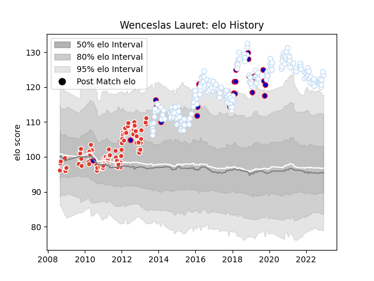

---  
layout: page  
title: Wenceslas Lauret  
date: 2023-01-06 00:19:27.233836  
categories: player  
---
# Wenceslas Lauret

## Positions: FL

## Country: France

## Current elo: 106.0

## Current Percentile: 86.0

# Elo History

# Match History

| Team               |   Appearances |   Win Rate |
|:-------------------|--------------:|-----------:|
| Racing 92          |           203 |   0.650246 |
| Biarritz Olympique |            87 |   0.482759 |
| France             |            28 |   0.357143 |

| Opponent             |   Matches |   Win Rate |
|:---------------------|----------:|-----------:|
| Clermont Auvergne    |        22 |   0.636364 |
| Stade Toulousain     |        21 |   0.47619  |
| Stade Francais Paris |        20 |   0.55     |
| Toulon               |        20 |   0.65     |
| Castres Olympique    |        18 |   0.527778 |
| Bordeaux Begles      |        17 |   0.529412 |
| Montpellier Herault  |        15 |   0.566667 |
| La Rochelle          |        14 |   0.5      |
| Brive                |        12 |   0.708333 |
| Lyon                 |        12 |   0.625    |
| Perpignan            |        10 |   0.6      |
| Agen                 |         9 |   0.722222 |
| Bayonne              |         9 |   0.888889 |
| Pau                  |         8 |   0.8125   |
| Oyonnax              |         7 |   0.714286 |
| Grenoble             |         6 |   0.666667 |
| Saracens             |         6 |   0.333333 |
| Munster              |         6 |   0.75     |
| Glasgow Warriors     |         5 |   0.4      |
| Leicester Tigers     |         5 |   0.8      |
| Wales                |         5 |   0        |
| Ospreys              |         5 |   0.9      |
| Scarlets             |         4 |   0.875    |
| Ireland              |         4 |   0.25     |
| Northampton Saints   |         4 |   0.875    |
| Bourgoin-Jallieu     |         4 |   0.75     |
| Benetton Treviso     |         4 |   0.75     |
| Argentina            |         4 |   0.75     |
| South Africa         |         3 |   0        |
| Scotland             |         3 |   0.333333 |
| Leinster             |         3 |   0        |
| Montauban            |         3 |   0.333333 |
| Italy                |         3 |   1        |
| Harlequins           |         3 |   0        |
| New Zealand          |         2 |   0        |
| Biarritz Olympique   |         2 |   0.5      |
| Ulster               |         2 |   0.5      |
| Cardiff Blues        |         2 |   0        |
| Connacht             |         2 |   0.5      |
| England              |         2 |   0.5      |
| Zebre                |         2 |   1        |
| Racing 92            |         2 |   0        |
| Aironi               |         2 |   0.5      |
| Fiji                 |         1 |   0        |
| Gloucester Rugby     |         1 |   1        |
| Tonga                |         1 |   1        |
| Mont-de-Marsan       |         1 |   1        |
| Wasps                |         1 |   1        |
| Exeter Chiefs        |         1 |   0        |