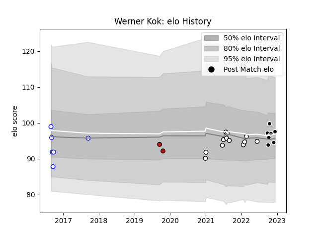

---  
layout: page  
title: Werner Kok  
date: 2022-12-14 11:31:33.773517  
categories: player  
---
# Werner Kok

## Positions: W, C

## Current elo: 98.0

## Current Percentile: 45.0

# Elo History

# Match History

| Team             |   Appearances |   Win Rate |
|:-----------------|--------------:|-----------:|
| Natal Sharks     |            12 |   0.583333 |
| Sharks           |             7 |   0.571429 |
| Western Province |             6 |   0.833333 |
| Stade Toulousain |             2 |   0        |

| Opponent               |   Matches |   Win Rate |
|:-----------------------|----------:|-----------:|
| Griquas                |         5 |   0.8      |
| Western Province       |         4 |   0.25     |
| Free State Cheetahs    |         3 |   0.666667 |
| Golden Lions           |         2 |   0.5      |
| La Rochelle            |         1 |   0        |
| Pumas                  |         1 |   1        |
| Natal Sharks           |         1 |   1        |
| Montpellier Herault    |         1 |   0        |
| Leinster               |         1 |   0        |
| Blue Bulls             |         1 |   1        |
| Harlequins             |         1 |   1        |
| Bulls                  |         1 |   0        |
| Glasgow Warriors       |         1 |   1        |
| Eastern Province Kings |         1 |   1        |
| Dragons                |         1 |   1        |
| Cardiff Blues          |         1 |   0        |
| Zebre                  |         1 |   1        |