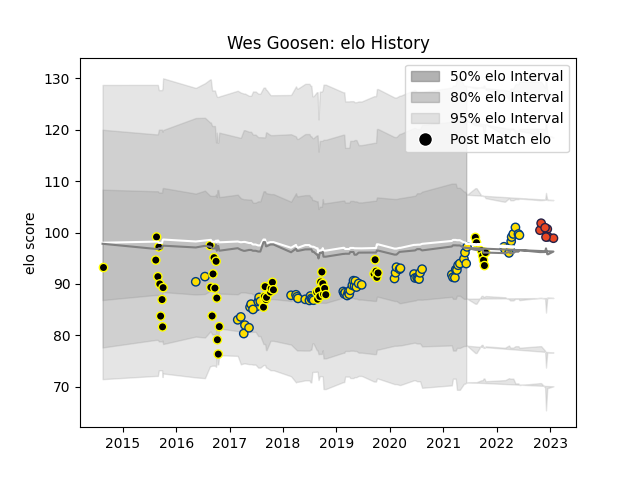

---  
layout: page  
title: Wes Goosen  
date: 2022-12-14 11:19:12.576354  
categories: player  
---
# Wes Goosen

## Positions: W, C

## Current elo: 112.0

## Current Percentile: 83.0

# Elo History

# Match History

| Team       |   Appearances |   Win Rate |
|:-----------|--------------:|-----------:|
| Hurricanes |            70 |   0.6      |
| Wellington |            52 |   0.644231 |
| Edinburgh  |             5 |   0.4      |

| Opponent                 |   Matches |   Win Rate |
|:-------------------------|----------:|-----------:|
| Chiefs                   |        12 |   0.541667 |
| Crusaders                |        12 |   0.25     |
| Blues                    |         9 |   0.555556 |
| Northland                |         6 |   1        |
| Waikato                  |         5 |   0.4      |
| North Harbour            |         5 |   0.6      |
| Taranaki                 |         5 |   0.6      |
| Highlanders              |         5 |   0.8      |
| Bay of Plenty            |         5 |   0.8      |
| Manawatu                 |         4 |   0.75     |
| Hawke's Bay              |         4 |   0.625    |
| Brumbies                 |         4 |   0.5      |
| Southland                |         4 |   1        |
| Otago                    |         4 |   0.5      |
| Queensland Reds          |         3 |   1        |
| Sharks                   |         3 |   1        |
| Tasman                   |         3 |   0        |
| Melbourne Rebels         |         3 |   1        |
| Auckland                 |         3 |   0.333333 |
| Bulls                    |         3 |   0.666667 |
| Sunwolves                |         2 |   1        |
| Western Force            |         2 |   0.5      |
| New South Wales Waratahs |         2 |   1        |
| Jaguares                 |         2 |   0.5      |
| Counties Manukau         |         2 |   1        |
| Moana Pasifika           |         2 |   0.5      |
| Canterbury               |         2 |   0.5      |
| Stormers                 |         2 |   0.5      |
| Lions                    |         1 |   0        |
| Benetton Treviso         |         1 |   0        |
| British and Irish Lions  |         1 |   0.5      |
| Cardiff Blues            |         1 |   1        |
| Saracens                 |         1 |   0        |
| Cheetahs                 |         1 |   1        |
| Fijian Drua              |         1 |   1        |
| Munster                  |         1 |   0        |
| Zebre                    |         1 |   1        |