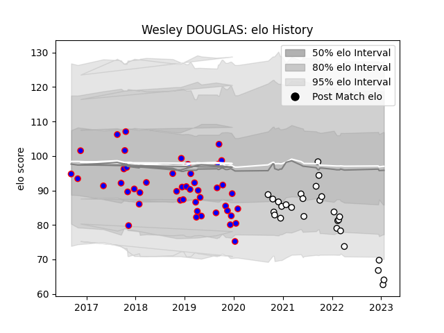

---  
layout: page  
title: Wesley DOUGLAS  
date: 2023-01-17 11:45:38.268671  
categories: player  
---
# Wesley DOUGLAS

## Positions: W, C

## Current elo: 63.0

## Current Percentile: 4.0

# Elo History

# Match History

| Team    |   Appearances |   Win Rate |
|:--------|--------------:|-----------:|
| Beziers |            47 |   0.542553 |
| Brive   |            27 |   0.314815 |

| Opponent             |   Matches |   Win Rate |
|:---------------------|----------:|-----------:|
| Vannes               |         5 |   0.4      |
| Carcassonne          |         4 |   0.75     |
| Nevers               |         4 |   0.625    |
| Colomiers            |         4 |   0.25     |
| Aurillac             |         4 |   0.25     |
| Montauban            |         3 |   0.666667 |
| Clermont Auvergne    |         3 |   0.333333 |
| Perpignan            |         3 |   0.333333 |
| Pau                  |         3 |   1        |
| La Rochelle          |         3 |   0        |
| Soyaux-Angouleme     |         3 |   0.333333 |
| Biarritz Olympique   |         2 |   0.5      |
| Provence Rugby       |         2 |   1        |
| Oyonnax              |         2 |   1        |
| Bordeaux Begles      |         2 |   0        |
| Castres Olympique    |         2 |   0.5      |
| Montpellier Herault  |         2 |   0.25     |
| Racing 92            |         2 |   0        |
| Mont-de-Marsan       |         2 |   0.5      |
| Rouen                |         2 |   1        |
| Stade Toulousain     |         2 |   0        |
| Connacht             |         2 |   0        |
| US Bressane          |         2 |   0.5      |
| Stade Francais Paris |         1 |   1        |
| Toulon               |         1 |   1        |
| Roval Drome XV       |         1 |   1        |
| Cardiff Blues        |         1 |   0        |
| Massy                |         1 |   1        |
| Lyon                 |         1 |   0        |
| Leicester Tigers     |         1 |   0        |
| Grenoble             |         1 |   0        |
| Dax                  |         1 |   1        |
| Brive                |         1 |   1        |
| Narbonne             |         1 |   0        |