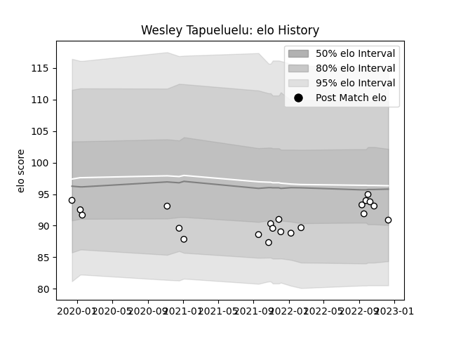

---  
layout: page  
title: Wesley Tapueluelu  
date: 2022-12-18 16:23:32.728720  
categories: player  
---
# Wesley Tapueluelu

## Positions: P

## Current elo: 91.0

## Current Percentile: 46.0

# Elo History

# Match History

| Team   |   Appearances |   Win Rate |
|:-------|--------------:|-----------:|
| Brive  |            21 |   0.333333 |

| Opponent             |   Matches |   Win Rate |
|:---------------------|----------:|-----------:|
| Stade Francais Paris |         3 |   0.333333 |
| Castres Olympique    |         2 |   0        |
| Toulon               |         2 |   0        |
| Zebre                |         2 |   0.5      |
| Bayonne              |         1 |   1        |
| Biarritz Olympique   |         1 |   0        |
| Bordeaux Begles      |         1 |   0        |
| Bristol Rugby        |         1 |   0        |
| Cardiff Blues        |         1 |   0        |
| Clermont Auvergne    |         1 |   1        |
| Lyon                 |         1 |   0        |
| Montpellier Herault  |         1 |   0        |
| Pau                  |         1 |   1        |
| Perpignan            |         1 |   1        |
| Racing 92            |         1 |   1        |
| Stade Toulousain     |         1 |   0        |