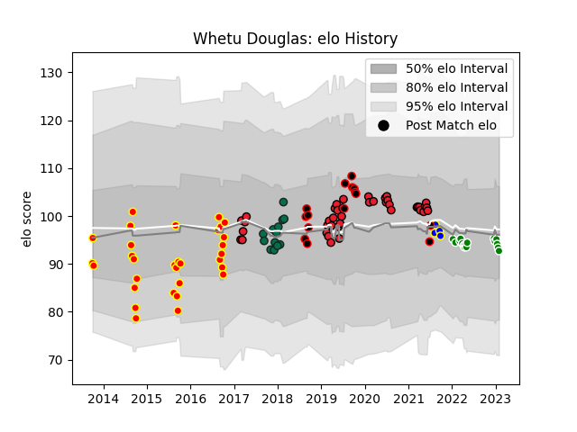

---  
layout: page  
title: Whetu Douglas  
date: 2023-02-02 19:02:45.520557  
categories: player  
---
# Whetu Douglas

## Positions: N8, FL

## Country: New Zealand Maori

## Current elo: 93.0

## Current Percentile: 43.0

# Elo History

# Match History

| Team                  |   Appearances |   Win Rate |
|:----------------------|--------------:|-----------:|
| Crusaders             |            40 |   0.8625   |
| Waikato               |            31 |   0.5      |
| Green Rockets Tokatsu |            16 |   0.0625   |
| Benetton Treviso      |            13 |   0.384615 |
| Canterbury            |            11 |   0.636364 |
| Bay of Plenty         |             4 |   0.25     |
| New Zealand Maori     |             4 |   0.75     |

| Opponent                          |   Matches |   Win Rate |
|:----------------------------------|----------:|-----------:|
| Chiefs                            |         6 |   0.666667 |
| Hurricanes                        |         6 |   0.833333 |
| Highlanders                       |         6 |   0.833333 |
| Tasman                            |         6 |   0        |
| Manawatu                          |         5 |   0.6      |
| Blues                             |         5 |   1        |
| Auckland                          |         4 |   0.25     |
| New South Wales Waratahs          |         4 |   0.75     |
| Taranaki                          |         4 |   0.375    |
| North Harbour                     |         4 |   1        |
| Wellington                        |         4 |   0.75     |
| Bay of Plenty                     |         4 |   1        |
| Canterbury                        |         3 |   0        |
| Counties Manukau                  |         3 |   0.333333 |
| Scarlets                          |         3 |   0.333333 |
| Hawke's Bay                       |         3 |   0.666667 |
| Yokohama Canon Eagles             |         3 |   0        |
| Queensland Reds                   |         3 |   1        |
| Kubota Spears Funabashi Tokyo-Bay |         3 |   0        |
| Ulster                            |         2 |   0        |
| Southland                         |         2 |   1        |
| Samoa                             |         2 |   1        |
| Otago                             |         2 |   0.5      |
| Northland                         |         2 |   0.5      |
| Sunwolves                         |         2 |   1        |
| Melbourne Rebels                  |         2 |   1        |
| Zebre                             |         2 |   1        |
| Kobelco Kobe Steelers             |         2 |   0        |
| Fiji                              |         2 |   0.5      |
| Cheetahs                          |         1 |   1        |
| Black Rams Tokyo                  |         1 |   0        |
| Western Force                     |         1 |   1        |
| Brumbies                          |         1 |   1        |
| Urayasu D-Rocks                   |         1 |   0        |
| Bulls                             |         1 |   1        |
| Toyota Verblitz                   |         1 |   0        |
| Toshiba Brave Lupus Tokyo         |         1 |   0        |
| Tokyo Sungoliath                  |         1 |   0        |
| Munster                           |         1 |   0        |
| Connacht                          |         1 |   0        |
| Bath Rugby                        |         1 |   0        |
| Stormers                          |         1 |   0.5      |
| Shizuoka Blue Revs                |         1 |   0        |
| Hanazono Kintetsu Liners          |         1 |   1        |
| Jaguares                          |         1 |   1        |
| Saitama Wild Knights              |         1 |   0        |
| Leinster                          |         1 |   0        |
| Lions                             |         1 |   1        |
| Dragons                           |         1 |   1        |