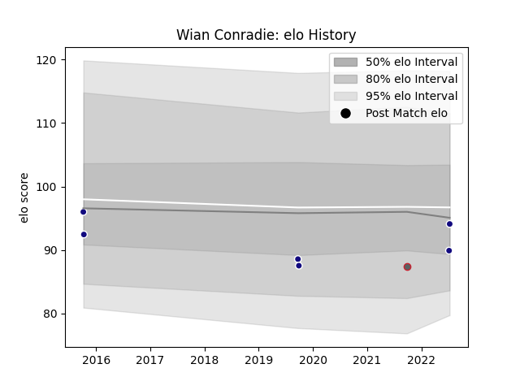

---  
layout: page  
title: Wian Conradie  
date: 2023-02-24 02:28:38.860527  
categories: player  
---
# Wian Conradie

## Positions: N8, FL

## Country: Namibia

## Current elo: 103.0

## Current Percentile: 57.0

# Elo History

# Match History

| Team                   |   Appearances |   Win Rate |
|:-----------------------|--------------:|-----------:|
| New England Free Jacks |            25 |   0.64     |
| Namibia                |            18 |   0.722222 |
| Doncaster              |             8 |   0.375    |
| Gloucester Rugby       |             1 |   0        |

| Opponent            |   Matches |   Win Rate |
|:--------------------|----------:|-----------:|
| Zimbabwe            |         4 |   1        |
| Rugby New York      |         4 |   0.5      |
| R.U. New York       |         4 |   0.5      |
| Toronto Arrows      |         3 |   0.666667 |
| Kenya               |         3 |   1        |
| Rugby ATL           |         3 |   0.666667 |
| NOLA Gold           |         3 |   0.333333 |
| Old Glory DC        |         2 |   0.5      |
| Utah Warriors       |         2 |   1        |
| Uganda              |         2 |   1        |
| Tunisia             |         2 |   1        |
| Yorkshire Carnegie  |         1 |   1        |
| Spain               |         1 |   0        |
| South Africa        |         1 |   0        |
| Seattle Seawolves   |         1 |   1        |
| San Diego Legion    |         1 |   1        |
| Ampthill            |         1 |   0        |
| Nottingham          |         1 |   1        |
| Argentina           |         1 |   0        |
| Morocco             |         1 |   1        |
| London Scottish     |         1 |   1        |
| Leicester Tigers    |         1 |   0        |
| Italy               |         1 |   0        |
| Houston SaberCats   |         1 |   1        |
| Georgia             |         1 |   0        |
| Ealing Trailfinders |         1 |   0        |
| Coventry            |         1 |   0        |
| Canada              |         1 |   1        |
| Bedford             |         1 |   0        |
| Austin Gilgronis    |         1 |   1        |
| Newcastle Falcons   |         1 |   0        |