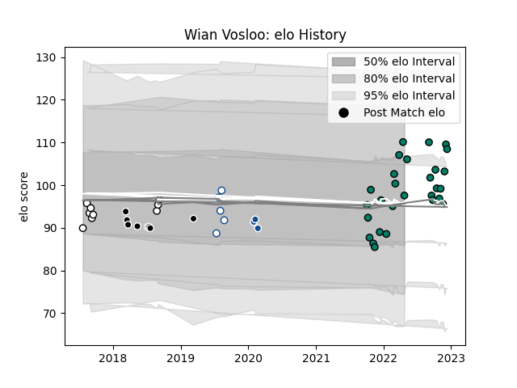

---  
layout: page  
title: Wian Vosloo  
date: 2023-02-02 19:07:53.371625  
categories: player  
---
# Wian Vosloo

## Positions: FL, L

## Current elo: 103.0

## Current Percentile: 76.0

# Elo History

# Match History

| Team         |   Appearances |   Win Rate |
|:-------------|--------------:|-----------:|
| Suresnes     |            32 |   0.375    |
| Natal Sharks |             9 |   0.888889 |
| Sharks       |             8 |   0.25     |
| Blue Bulls   |             5 |   0.4      |
| Bulls        |             3 |   0        |

| Opponent                   |   Matches |   Win Rate |
|:---------------------------|----------:|-----------:|
| Nice                       |         4 |   0.25     |
| Free State Cheetahs        |         3 |   0.666667 |
| Blagnac                    |         3 |   0.333333 |
| Valence Romans Drome Rugby |         3 |   0        |
| Bourgoin-Jallieu           |         3 |   0.666667 |
| Pumas                      |         3 |   1        |
| Albi                       |         2 |   0        |
| Stormers                   |         2 |   0        |
| Rennes                     |         2 |   1        |
| Narbonne                   |         2 |   0        |
| Massy                      |         2 |   0        |
| Golden Lions               |         2 |   1        |
| Griquas                    |         2 |   0.5      |
| Bulls                      |         2 |   0        |
| Carqueiranne-Hyères        |         2 |   0.5      |
| Dax                        |         2 |   0        |
| Western Province           |         2 |   0.5      |
| Jaguares                   |         1 |   1        |
| Cognac Saint Jean d'Angély |         1 |   1        |
| Melbourne Rebels           |         1 |   0        |
| Chambery                   |         1 |   1        |
| Natal Sharks               |         1 |   0        |
| Aubenas                    |         1 |   1        |
| Crusaders                  |         1 |   0        |
| Brumbies                   |         1 |   0        |
| Sharks                     |         1 |   0        |
| Soyaux-Angouleme           |         1 |   0        |
| Blues                      |         1 |   0        |
| Sunwolves                  |         1 |   1        |
| Tarbes                     |         1 |   1        |
| US Bressane                |         1 |   0        |
| Blue Bulls                 |         1 |   1        |
| Dijon                      |         1 |   1        |