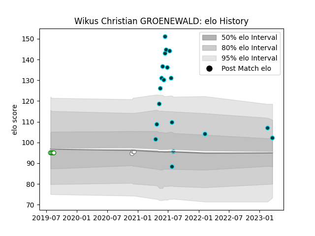

---  
layout: page  
title: Wikus Christian GROENEWALD  
date: 2023-03-28 18:13:39.480606  
categories: player  
---
# Wikus Christian GROENEWALD

Last updated: 2023-03-28
## Positions: P

## Current elo: 102.0

## Current Percentile: None

# Elo History

# Match History

| Team      |   Appearances |   Win Rate |
|:----------|--------------:|-----------:|
| Rugby ATL |            19 |   0.684211 |
| Leopards  |             4 |   0.5      |
| Pumas     |             3 |   0.333333 |

| Opponent               |   Matches |   Win Rate |
|:-----------------------|----------:|-----------:|
| Old Glory DC           |         2 |        1   |
| Toronto Arrows         |         2 |        1   |
| Rugby New York         |         2 |        0.5 |
| L. A. Giltinis         |         2 |        0.5 |
| NOLA Gold              |         2 |        1   |
| R.U. New York          |         2 |        0.5 |
| New England Free Jacks |         2 |        0.5 |
| Austin Gilgronis       |         1 |        0   |
| Utah Warriors          |         1 |        1   |
| Seattle Seawolves      |         1 |        1   |
| San Diego Legion       |         1 |        0   |
| Natal Sharks           |         1 |        0   |
| Boland Cavaliers       |         1 |        1   |
| Jaguares XV            |         1 |        0   |
| Houston SaberCats      |         1 |        1   |
| Griquas                |         1 |        1   |
| Griffons               |         1 |        0   |
| Border Bulldogs        |         1 |        1   |
| Western Province       |         1 |        0   |