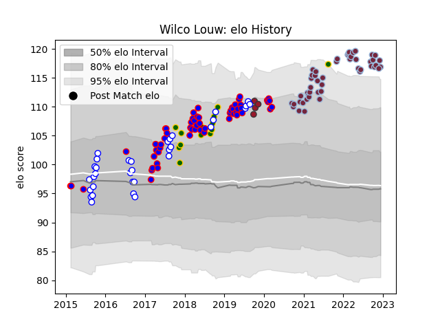

---  
layout: page  
title: Wilco Louw  
date: 2023-03-16 19:52:32.752289  
categories: player  
---
# Wilco Louw

## Positions: P

## Country: South Africa

## Current elo: 93.0

## Current Percentile: 83.0

# Elo History

# Match History

| Team             |   Appearances |   Win Rate |
|:-----------------|--------------:|-----------:|
| Harlequins       |            59 |   0.567797 |
| Stormers         |            56 |   0.526786 |
| Western Province |            39 |   0.615385 |
| South Africa     |            14 |   0.5      |
| Toulon           |             5 |   0.5      |

| Opponent                 |   Matches |   Win Rate |
|:-------------------------|----------:|-----------:|
| Blue Bulls               |         9 |   0.666667 |
| Sharks                   |         9 |   0.333333 |
| Bulls                    |         8 |   0.75     |
| Jaguares                 |         6 |   0.666667 |
| Natal Sharks             |         6 |   0.5      |
| Golden Lions             |         6 |   0.333333 |
| Gloucester Rugby         |         6 |   0.833333 |
| Bristol Rugby            |         6 |   0.333333 |
| Free State Cheetahs      |         6 |   0.333333 |
| Lions                    |         6 |   0.333333 |
| Exeter Chiefs            |         6 |   0.333333 |
| Griquas                  |         5 |   0.8      |
| London Irish             |         5 |   0.7      |
| Leicester Tigers         |         5 |   0.6      |
| Northampton Saints       |         5 |   0.6      |
| Blues                    |         5 |   0.6      |
| Wasps                    |         5 |   0.8      |
| Newcastle Falcons        |         4 |   0.75     |
| Saracens                 |         4 |   0        |
| Sunwolves                |         4 |   0.75     |
| Pumas                    |         4 |   1        |
| Hurricanes               |         3 |   0.333333 |
| Sale Sharks              |         3 |   0.666667 |
| Argentina                |         3 |   0.666667 |
| Chiefs                   |         3 |   0.333333 |
| Bath Rugby               |         3 |   1        |
| Highlanders              |         3 |   0.333333 |
| Crusaders                |         3 |   0.166667 |
| Eastern Province Kings   |         2 |   1        |
| Wales                    |         2 |   0        |
| Racing 92                |         2 |   0        |
| New Zealand              |         2 |   0.5      |
| Worcester Warriors       |         2 |   1        |
| Melbourne Rebels         |         2 |   1        |
| England                  |         2 |   0.5      |
| Australia                |         2 |   0.5      |
| Munster                  |         1 |   0        |
| Boland Cavaliers         |         1 |   1        |
| Western Force            |         1 |   1        |
| La Rochelle              |         1 |   1        |
| Bayonne                  |         1 |   1        |
| Stade Francais Paris     |         1 |   0        |
| Southern Kings           |         1 |   1        |
| Brumbies                 |         1 |   0        |
| Brive                    |         1 |   0        |
| Montpellier Herault      |         1 |   0.5      |
| France                   |         1 |   1        |
| Queensland Reds          |         1 |   1        |
| Cheetahs                 |         1 |   1        |
| Italy                    |         1 |   1        |
| New South Wales Waratahs |         1 |   0        |
| Ireland                  |         1 |   0        |