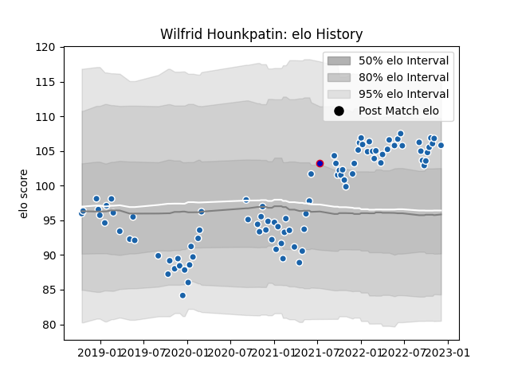

---  
layout: page  
title: Wilfrid Hounkpatin  
date: 2022-12-09 13:21:06.575668  
categories: player  
---
# Wilfrid Hounkpatin

## Positions: P

## Country: France

## Current elo: 106.0

## Current Percentile: 85.0

# Elo History

# Match History

| Team              |   Appearances |   Win Rate |
|:------------------|--------------:|-----------:|
| Castres Olympique |            90 |        0.6 |
| France            |             1 |        1   |

| Opponent             |   Matches |   Win Rate |
|:---------------------|----------:|-----------:|
| Racing 92            |         8 |  0.375     |
| Montpellier Herault  |         7 |  0.571429  |
| Toulon               |         7 |  0.428571  |
| Bordeaux Begles      |         7 |  0.0714286 |
| Pau                  |         7 |  0.857143  |
| Stade Toulousain     |         6 |  0.583333  |
| Brive                |         6 |  0.666667  |
| Stade Francais Paris |         6 |  0.333333  |
| Lyon                 |         5 |  0.8       |
| Clermont Auvergne    |         5 |  0.8       |
| La Rochelle          |         5 |  0.4       |
| Agen                 |         4 |  1         |
| Perpignan            |         3 |  0.666667  |
| Bayonne              |         3 |  1         |
| Munster              |         2 |  0.5       |
| Gloucester Rugby     |         2 |  0.5       |
| Biarritz Olympique   |         2 |  1         |
| Worcester Warriors   |         2 |  1         |
| Australia            |         1 |  1         |
| RC Enisei            |         1 |  1         |
| Exeter Chiefs        |         1 |  1         |
| Dragons              |         1 |  1         |