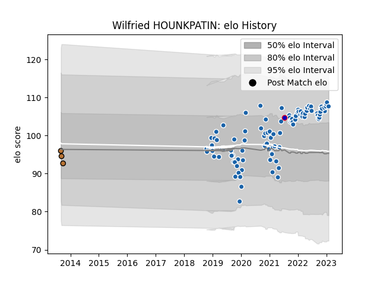

---  
layout: page  
title: Wilfried HOUNKPATIN  
date: 2023-01-21 15:44:11.139098  
categories: player  
---
# Wilfried HOUNKPATIN

## Positions: P

## Country: France

## Current elo: 108.0

## Current Percentile: 84.0

# Elo History

# Match History

| Team              |   Appearances |   Win Rate |
|:------------------|--------------:|-----------:|
| Castres Olympique |            99 |   0.580808 |
| Narbonne          |             3 |   0.333333 |
| France            |             1 |   1        |

| Opponent             |   Matches |   Win Rate |
|:---------------------|----------:|-----------:|
| Racing 92            |         9 |  0.388889  |
| Stade Francais Paris |         8 |  0.375     |
| Montpellier Herault  |         8 |  0.625     |
| Toulon               |         7 |  0.428571  |
| Stade Toulousain     |         7 |  0.5       |
| Bordeaux Begles      |         7 |  0.0714286 |
| Pau                  |         7 |  0.857143  |
| Agen                 |         6 |  0.833333  |
| Lyon                 |         6 |  0.666667  |
| Brive                |         6 |  0.666667  |
| La Rochelle          |         5 |  0.4       |
| Clermont Auvergne    |         5 |  0.8       |
| Bayonne              |         4 |  0.75      |
| Perpignan            |         3 |  0.666667  |
| Gloucester Rugby     |         2 |  0.5       |
| Exeter Chiefs        |         2 |  0.5       |
| Munster              |         2 |  0.5       |
| Biarritz Olympique   |         2 |  1         |
| Worcester Warriors   |         2 |  1         |
| Aurillac             |         1 |  1         |
| Edinburgh            |         1 |  0         |
| Dragons              |         1 |  1         |
| RC Enisei            |         1 |  1         |
| Australia            |         1 |  1         |