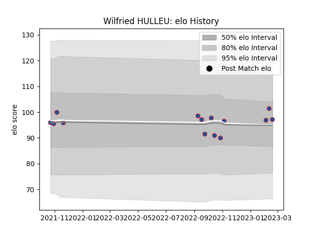

---  
layout: page  
title: Wilfried HULLEU  
date: 2023-02-10 10:37:27.439426  
categories: player  
---
# Wilfried HULLEU

## Positions: W

## Current elo: 92.0

## Current Percentile: 38.0

# Elo History

# Match History

| Team     |   Appearances |   Win Rate |
|:---------|--------------:|-----------:|
| Grenoble |            12 |   0.458333 |

| Opponent       |   Matches |   Win Rate |
|:---------------|----------:|-----------:|
| Carcassonne    |         2 |       0.5  |
| Nevers         |         2 |       0.75 |
| Provence Rugby |         2 |       0    |
| Agen           |         1 |       1    |
| Aurillac       |         1 |       1    |
| Colomiers      |         1 |       0    |
| Oyonnax        |         1 |       0    |
| Rouen          |         1 |       1    |
| Vannes         |         1 |       0    |