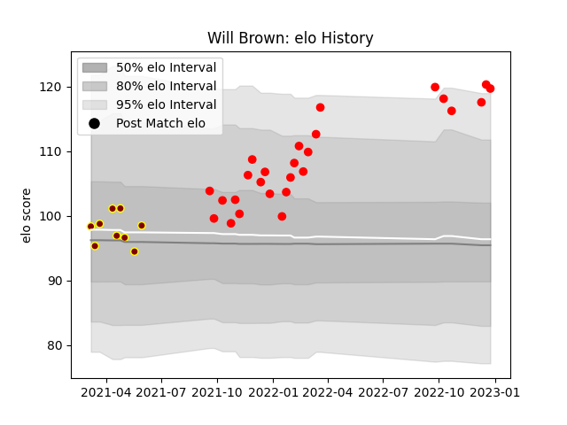

---  
layout: page  
title: Will Brown  
date: 2022-12-18 16:32:36.947839  
categories: player  
---
# Will Brown

## Positions: W

## Current elo: 112.0

## Current Percentile: 88.0

# Elo History

# Match History

| Team     |   Appearances |   Win Rate |
|:---------|--------------:|-----------:|
| Jersey   |            24 |   0.729167 |
| Ampthill |             9 |   0.333333 |

| Opponent            |   Matches |   Win Rate |
|:--------------------|----------:|-----------:|
| Doncaster           |         4 |   0.25     |
| Nottingham          |         4 |   1        |
| Bedford             |         3 |   0.333333 |
| Cornish Pirates     |         3 |   0.666667 |
| Coventry            |         3 |   0.666667 |
| Ealing Trailfinders |         3 |   0        |
| Hartpury College    |         3 |   1        |
| London Scottish     |         3 |   1        |
| Ampthill            |         2 |   0.75     |
| Richmond            |         2 |   1        |
| Caldy               |         1 |   1        |
| Jersey              |         1 |   0        |
| Saracens            |         1 |   0        |