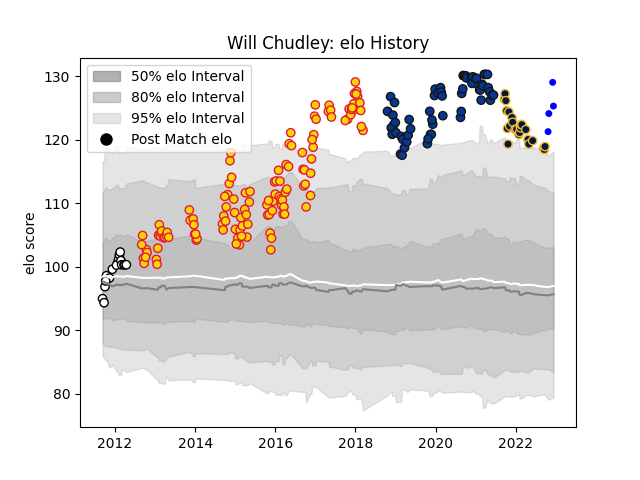

---  
layout: page  
title: Will Chudley  
date: 2023-02-02 18:44:05.033934  
categories: player  
---
# Will Chudley

## Positions: SH

## Current elo: 93.0

## Current Percentile: 51.0

# Elo History

# Match History

| Team               |   Appearances |   Win Rate |
|:-------------------|--------------:|-----------:|
| Exeter Chiefs      |           121 |   0.603306 |
| Bath Rugby         |            60 |   0.491667 |
| Worcester Warriors |            24 |   0.270833 |
| Newcastle Falcons  |            17 |   0.558824 |
| Coventry           |             8 |   0.8125   |

| Opponent            |   Matches |   Win Rate |
|:--------------------|----------:|-----------:|
| Leicester Tigers    |        19 |   0.421053 |
| Wasps               |        19 |   0.552632 |
| Harlequins          |        19 |   0.605263 |
| Saracens            |        18 |   0.388889 |
| Northampton Saints  |        18 |   0.666667 |
| Sale Sharks         |        17 |   0.617647 |
| Newcastle Falcons   |        15 |   0.633333 |
| Gloucester Rugby    |        13 |   0.576923 |
| London Irish        |        12 |   0.666667 |
| Bath Rugby          |        12 |   0.5      |
| Worcester Warriors  |        12 |   0.75     |
| Exeter Chiefs       |         9 |   0.111111 |
| Bristol Rugby       |         7 |   0.285714 |
| Leinster            |         6 |   0        |
| London Welsh        |         4 |   0.75     |
| Clermont Auvergne   |         4 |   0.25     |
| Bordeaux Begles     |         3 |   0.666667 |
| Cardiff Blues       |         3 |   1        |
| Toulon              |         2 |   0.5      |
| Montpellier Herault |         2 |   1        |
| Glasgow Warriors    |         2 |   0        |
| Connacht            |         1 |   1        |
| Lyon                |         1 |   1        |
| Bayonne             |         1 |   1        |
| Jersey              |         1 |   0.5      |
| Hartpury College    |         1 |   0        |
| Nottingham          |         1 |   1        |
| Ospreys             |         1 |   0        |
| Petrarca Padova     |         1 |   1        |
| Richmond            |         1 |   1        |
| Caldy               |         1 |   1        |
| Cornish Pirates     |         1 |   1        |
| Doncaster           |         1 |   1        |
| Ulster              |         1 |   0        |
| Ealing Trailfinders |         1 |   1        |