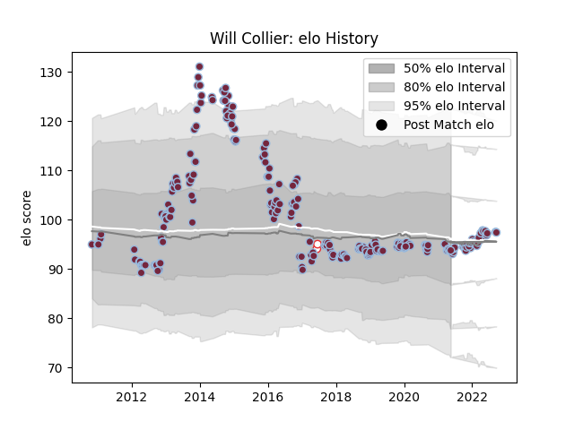

---  
layout: page  
title: Will Collier  
date: 2023-03-17 17:30:40.649182  
categories: player  
---
# Will Collier

## Positions: P

## Country: England

## Current elo: 94.0

## Current Percentile: 44.0

# Elo History

# Match History

| Team       |   Appearances |   Win Rate |
|:-----------|--------------:|-----------:|
| Harlequins |           233 |   0.577253 |
| England    |             2 |   1        |

| Opponent             |   Matches |   Win Rate |
|:---------------------|----------:|-----------:|
| Bath Rugby           |        20 |   0.675    |
| Saracens             |        19 |   0.263158 |
| Wasps                |        19 |   0.736842 |
| Leicester Tigers     |        18 |   0.416667 |
| Sale Sharks          |        17 |   0.588235 |
| Exeter Chiefs        |        17 |   0.294118 |
| Worcester Warriors   |        16 |   0.625    |
| Northampton Saints   |        16 |   0.4375   |
| Gloucester Rugby     |        14 |   0.678571 |
| London Irish         |        13 |   0.615385 |
| Newcastle Falcons    |        12 |   0.75     |
| Bristol Rugby        |         7 |   0.857143 |
| Cardiff Blues        |         5 |   0.8      |
| London Welsh         |         4 |   1        |
| Clermont Auvergne    |         3 |   0        |
| Castres Olympique    |         3 |   1        |
| Montpellier Herault  |         3 |   0.333333 |
| Racing 92            |         2 |   1        |
| Scarlets             |         2 |   0.5      |
| Agen                 |         2 |   1        |
| Leinster             |         2 |   0.5      |
| Argentina            |         2 |   1        |
| Grenoble             |         2 |   0.5      |
| Connacht             |         2 |   1        |
| Biarritz Olympique   |         2 |   1        |
| Benetton Treviso     |         2 |   0.5      |
| Zebre                |         2 |   1        |
| Munster              |         1 |   0        |
| La Rochelle          |         1 |   0        |
| Ospreys              |         1 |   1        |
| Edinburgh            |         1 |   0        |
| Dragons              |         1 |   1        |
| Calvisano            |         1 |   1        |
| Stade Francais Paris |         1 |   1        |
| Toulon               |         1 |   0        |
| Ulster               |         1 |   0        |