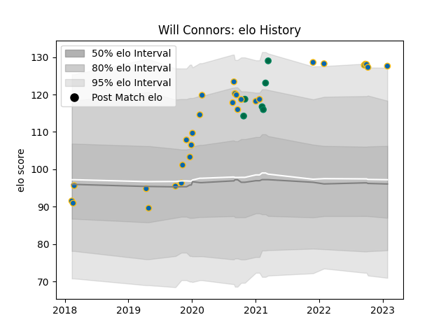

---  
layout: page  
title: Will Connors  
date: 2023-02-02 19:08:28.942868  
categories: player  
---
# Will Connors

## Positions: FL

## Country: Ireland

## Current elo: 128.0

## Current Percentile: 94.0

# Elo History

# Match History

| Team     |   Appearances |   Win Rate |
|:---------|--------------:|-----------:|
| Leinster |            29 |   0.758621 |
| Ireland  |             6 |   0.5      |

| Opponent         |   Matches |   Win Rate |
|:-----------------|----------:|-----------:|
| Ulster           |         6 |   0.666667 |
| Munster          |         4 |   1        |
| Glasgow Warriors |         3 |   0.666667 |
| Benetton Treviso |         3 |   1        |
| Connacht         |         3 |   0.666667 |
| France           |         2 |   0        |
| Italy            |         2 |   1        |
| Cardiff Blues    |         2 |   0.5      |
| Dragons          |         1 |   1        |
| Edinburgh        |         1 |   0        |
| Saracens         |         1 |   0        |
| Scarlets         |         1 |   1        |
| Scotland         |         1 |   1        |
| Sharks           |         1 |   1        |
| Southern Kings   |         1 |   1        |
| Cheetahs         |         1 |   1        |
| Wales            |         1 |   0        |
| Zebre            |         1 |   1        |