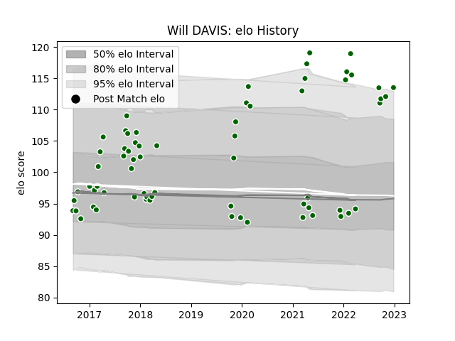

---  
layout: page  
title: Will DAVIS  
date: 2023-01-17 11:42:57.648915  
categories: player  
---
# Will DAVIS

## Positions: P

## Current elo: 111.0

## Current Percentile: 83.0

# Elo History

# Match History

| Team                |   Appearances |   Win Rate |
|:--------------------|--------------:|-----------:|
| Ealing Trailfinders |            67 |   0.791045 |

| Opponent           |   Matches |   Win Rate |
|:-------------------|----------:|-----------:|
| Jersey             |         8 |   1        |
| Hartpury College   |         6 |   1        |
| Richmond           |         6 |   1        |
| Nottingham         |         6 |   0.833333 |
| Cornish Pirates    |         6 |   0.583333 |
| Doncaster          |         6 |   0.833333 |
| Bedford            |         5 |   1        |
| Yorkshire Carnegie |         4 |   0.5      |
| Coventry           |         4 |   0.875    |
| London Scottish    |         3 |   1        |
| Rotherham Titans   |         3 |   1        |
| Ampthill           |         3 |   1        |
| London Irish       |         2 |   0        |
| Bristol Rugby      |         2 |   0        |
| Newcastle Falcons  |         1 |   0        |
| Caldy              |         1 |   0        |
| Saracens           |         1 |   0        |