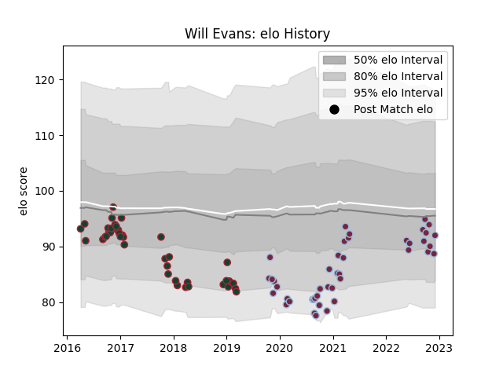

---  
layout: page  
title: Will Evans  
date: 2022-12-09 13:20:28.617337  
categories: player  
---
# Will Evans

## Positions: FL

## Current elo: 92.0

## Current Percentile: 22.0

# Elo History

# Match History

| Team             |   Appearances |   Win Rate |
|:-----------------|--------------:|-----------:|
| Harlequins       |            43 |   0.523256 |
| Leicester Tigers |            40 |   0.525    |

| Opponent           |   Matches |   Win Rate |
|:-------------------|----------:|-----------:|
| Bath Rugby         |        10 |   0.6      |
| Gloucester Rugby   |         9 |   1        |
| Exeter Chiefs      |         6 |   0        |
| Wasps              |         6 |   0.5      |
| Saracens           |         6 |   0        |
| Northampton Saints |         6 |   0.833333 |
| Worcester Warriors |         6 |   0.5      |
| Bristol Rugby      |         5 |   0.4      |
| Sale Sharks        |         5 |   0.8      |
| London Irish       |         5 |   0.7      |
| Leicester Tigers   |         3 |   0.666667 |
| Racing 92          |         3 |   0.333333 |
| Glasgow Warriors   |         2 |   0        |
| Munster            |         2 |   0.5      |
| Newcastle Falcons  |         2 |   1        |
| Ulster             |         2 |   0        |
| Dragons            |         1 |   1        |
| Clermont Auvergne  |         1 |   0        |
| Castres Olympique  |         1 |   0        |
| Scarlets           |         1 |   0        |
| Cardiff Blues      |         1 |   1        |