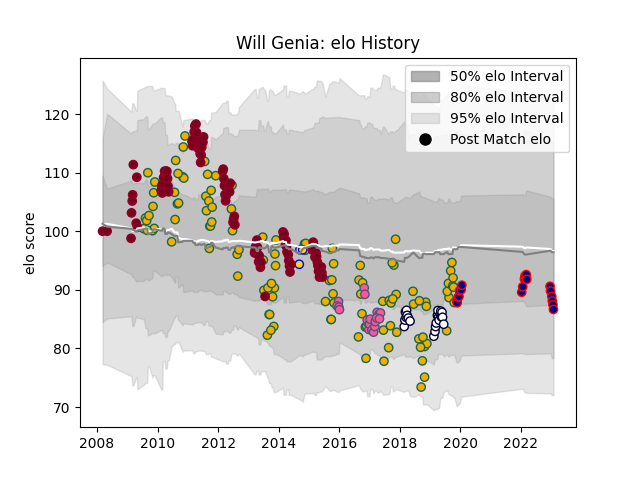

---  
layout: page  
title: Will Genia  
date: 2022-12-28 12:55:32.394308  
categories: player  
---
# Will Genia

## Positions: SH

## Country: Australia

## Current elo: 114.0

## Current Percentile: 93.0

# Elo History

# Match History

| Team                     |   Appearances |   Win Rate |
|:-------------------------|--------------:|-----------:|
| Australia                |           112 |   0.53125  |
| Queensland Reds          |            99 |   0.525253 |
| Melbourne Rebels         |            22 |   0.5      |
| Stade Francais Paris     |            21 |   0.571429 |
| Hanazono Kintetsu Liners |            15 |   0.733333 |
| Brisbane City            |             3 |   0.666667 |

| Opponent                         |   Matches |   Win Rate |
|:---------------------------------|----------:|-----------:|
| New Zealand                      |        28 |   0.142857 |
| South Africa                     |        20 |   0.55     |
| Brumbies                         |        14 |   0.535714 |
| Wales                            |        13 |   0.846154 |
| New South Wales Waratahs         |        12 |   0.25     |
| Argentina                        |        10 |   0.9      |
| Western Force                    |        10 |   0.65     |
| Crusaders                        |         8 |   0.375    |
| Melbourne Rebels                 |         8 |   0.75     |
| Stormers                         |         8 |   0.375    |
| Sharks                           |         8 |   0.375    |
| England                          |         8 |   0.25     |
| Blues                            |         8 |   0.625    |
| Ireland                          |         7 |   0.357143 |
| Bulls                            |         7 |   0.428571 |
| Lions                            |         7 |   0.428571 |
| Chiefs                           |         6 |   0.666667 |
| Highlanders                      |         6 |   0.833333 |
| Scotland                         |         6 |   0.5      |
| Cheetahs                         |         6 |   0.833333 |
| Hurricanes                       |         6 |   0        |
| Italy                            |         4 |   1        |
| British and Irish Lions          |         3 |   0.333333 |
| Queensland Reds                  |         3 |   1        |
| Bordeaux Begles                  |         3 |   0.333333 |
| Sunwolves                        |         3 |   1        |
| France                           |         3 |   0.666667 |
| Fiji                             |         3 |   1        |
| Uruguay                          |         2 |   1        |
| Mitsubishi Dynaboars             |         2 |   0        |
| Kamaishi Seawaves                |         2 |   1        |
| Stade Toulousain                 |         2 |   0.5      |
| United States of America         |         2 |   1        |
| Lyon                             |         2 |   0.5      |
| Benetton Treviso                 |         1 |   1        |
| Ospreys                          |         1 |   1        |
| Oyonnax                          |         1 |   0        |
| Bayonne                          |         1 |   1        |
| Russia                           |         1 |   1        |
| Racing 92                        |         1 |   1        |
| Samoa                            |         1 |   1        |
| Toyota Industries Shuttles Aichi |         1 |   1        |
| Shimizu Blue Sharks              |         1 |   1        |
| Toulon                           |         1 |   1        |
| Skyactivs Hiroshima              |         1 |   1        |
| Brive                            |         1 |   1        |
| NSW Country Eagles               |         1 |   1        |
| Mie Honda Heat                   |         1 |   1        |
| Canberra Vikings                 |         1 |   1        |
| Clermont Auvergne                |         1 |   0        |
| Coca-Cola Red Sparks             |         1 |   1        |
| Edinburgh                        |         1 |   0        |
| Georgia                          |         1 |   1        |
| Gloucester Rugby                 |         1 |   1        |
| Green Rockets Tokatsu            |         1 |   0        |
| Grenoble                         |         1 |   0        |
| Harlequins                       |         1 |   1        |
| Hino Red Dolphins                |         1 |   1        |
| Jaguares                         |         1 |   0        |
| Kobelco Kobe Steelers            |         1 |   0        |
| Bath Rugby                       |         1 |   1        |
| Kyuden Voltex                    |         1 |   1        |
| La Rochelle                      |         1 |   0        |
| Mazda Blue Zoomers               |         1 |   1        |
| Melbourne Rising                 |         1 |   0        |
| Kurita Water Gush                |         1 |   1        |