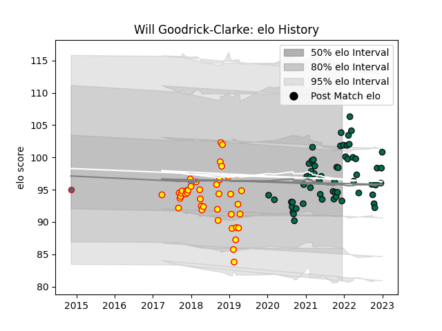

---  
layout: page  
title: Will Goodrick-Clarke  
date: 2022-12-18 16:35:05.803157  
categories: player  
---
# Will Goodrick-Clarke

## Positions: P

## Current elo: 101.0

## Current Percentile: 78.0

# Elo History

# Match History

| Team             |   Appearances |   Win Rate |
|:-----------------|--------------:|-----------:|
| London Irish     |            55 |   0.354545 |
| Richmond         |            22 |   0.272727 |
| Gloucester Rugby |             1 |   1        |

| Opponent            |   Matches |   Win Rate |
|:--------------------|----------:|-----------:|
| Sale Sharks         |         6 |   0.166667 |
| Exeter Chiefs       |         6 |   0.5      |
| Gloucester Rugby    |         6 |   0.25     |
| Bristol Rugby       |         4 |   0.375    |
| Wasps               |         4 |   0.375    |
| Harlequins          |         4 |   0.375    |
| Newcastle Falcons   |         4 |   0.75     |
| Bath Rugby          |         4 |   0.5      |
| Leicester Tigers    |         4 |   0        |
| Worcester Warriors  |         3 |   0.333333 |
| Bedford             |         3 |   0        |
| Saracens            |         3 |   0.5      |
| Northampton Saints  |         3 |   0        |
| Jersey              |         2 |   0        |
| London Scottish     |         2 |   1        |
| Nottingham          |         2 |   0.5      |
| Yorkshire Carnegie  |         2 |   0        |
| Hartpury College    |         2 |   0.5      |
| Ealing Trailfinders |         2 |   0.5      |
| Doncaster           |         2 |   0        |
| Coventry            |         2 |   0.5      |
| Cornish Pirates     |         2 |   0        |
| London Irish        |         1 |   0        |
| London Welsh        |         1 |   1        |
| Edinburgh           |         1 |   1        |
| Stormers            |         1 |   0        |
| Bayonne             |         1 |   0        |
| Agen                |         1 |   1        |