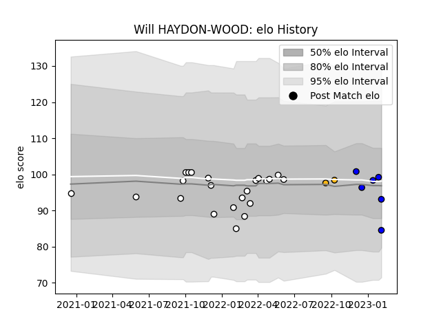

---  
layout: page  
title: Will HAYDON-WOOD  
date: 2023-02-08 11:11:03.162014  
categories: player  
---
# Will HAYDON-WOOD

## Positions: FH

## Current elo: 85.0

## Current Percentile: 47.0

# Elo History

# Match History

| Team              |   Appearances |   Win Rate |
|:------------------|--------------:|-----------:|
| Newcastle Falcons |            22 |   0.295455 |
| Massy             |             6 |   0.5      |
| Wasps             |             2 |   0        |

| Opponent           |   Matches |   Win Rate |
|:-------------------|----------:|-----------:|
| Worcester Warriors |         3 |   0.833333 |
| Bristol Rugby      |         3 |   0.333333 |
| Carcassonne        |         2 |   1        |
| Wasps              |         2 |   0.5      |
| Exeter Chiefs      |         2 |   0        |
| Saracens           |         2 |   0        |
| Harlequins         |         2 |   0        |
| Bath Rugby         |         2 |   0.5      |
| London Irish       |         2 |   0        |
| Northampton Saints |         2 |   0        |
| Montauban          |         1 |   1        |
| Sale Sharks        |         1 |   0        |
| Agen               |         1 |   0        |
| Mont-de-Marsan     |         1 |   0        |
| Grenoble           |         1 |   0        |
| Gloucester Rugby   |         1 |   0        |
| Castres Olympique  |         1 |   1        |
| Leicester Tigers   |         1 |   0        |