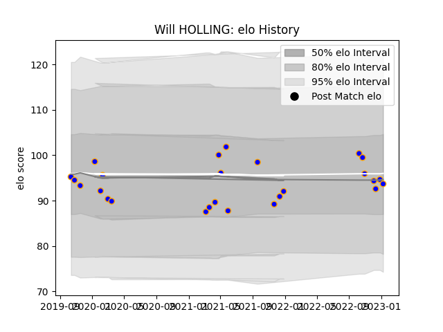

---  
layout: page  
title: Will HOLLING  
date: 2023-02-06 11:15:46.488696  
categories: player  
---
# Will HOLLING

## Positions: H

## Current elo: 98.0

## Current Percentile: 47.0

# Elo History

# Match History

| Team      |   Appearances |   Win Rate |
|:----------|--------------:|-----------:|
| Doncaster |            29 |   0.586207 |

| Opponent            |   Matches |   Win Rate |
|:--------------------|----------:|-----------:|
| Hartpury College    |         4 |   0.75     |
| Bedford             |         3 |   0.666667 |
| Coventry            |         3 |   0        |
| Jersey              |         3 |   0.333333 |
| London Scottish     |         3 |   1        |
| Nottingham          |         3 |   1        |
| Ampthill            |         2 |   1        |
| Cornish Pirates     |         2 |   0        |
| Ealing Trailfinders |         2 |   0        |
| Richmond            |         2 |   1        |
| Caldy               |         1 |   1        |
| Newcastle Falcons   |         1 |   0        |