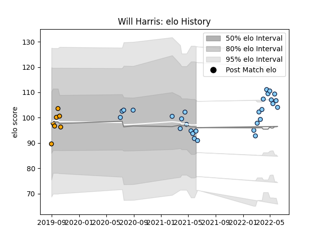

---  
layout: page  
title: Will Harris  
date: 2023-03-21 18:25:40.637258  
categories: player  
---
# Will Harris

Last updated: 2023-03-21
## Positions: N8, FL

## Current elo: 95.0

## Current Percentile: 38.0

# Elo History

# Match History

| Team                     |   Appearances |   Win Rate |
|:-------------------------|--------------:|-----------:|
| New South Wales Waratahs |            33 |   0.333333 |
| NSW Country Eagles       |             7 |   0.5      |

| Opponent           |   Matches |   Win Rate |
|:-------------------|----------:|-----------:|
| Queensland Reds    |         5 |      0     |
| Western Force      |         5 |      0.8   |
| Brumbies           |         4 |      0     |
| Fijian Drua        |         4 |      0.875 |
| Melbourne Rebels   |         4 |      0.5   |
| Chiefs             |         3 |      0     |
| Hurricanes         |         3 |      0     |
| Blues              |         2 |      0     |
| Crusaders          |         2 |      0.5   |
| Highlanders        |         2 |      0.5   |
| Brisbane City      |         1 |      0     |
| Canberra Vikings   |         1 |      0     |
| Melbourne Rising   |         1 |      1     |
| Moana Pasifika     |         1 |      1     |
| Queensland Country |         1 |      0     |
| Sydney Rays        |         1 |      1     |