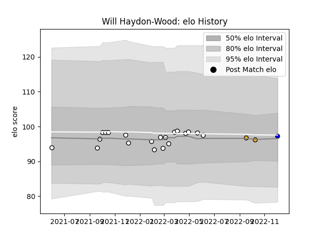

---  
layout: page  
title: Will Haydon-Wood  
date: 2022-12-18 16:23:53.814185  
categories: player  
---
# Will Haydon-Wood

## Positions: FH

## Current elo: 95.0

## Current Percentile: 57.0

# Elo History

# Match History

| Team              |   Appearances |   Win Rate |
|:------------------|--------------:|-----------:|
| Newcastle Falcons |            20 |      0.225 |
| Massy             |             2 |      0     |
| Wasps             |             2 |      0     |

| Opponent           |   Matches |   Win Rate |
|:-------------------|----------:|-----------:|
| Bristol Rugby      |         3 |   0.333333 |
| Bath Rugby         |         2 |   0.5      |
| Exeter Chiefs      |         2 |   0        |
| Harlequins         |         2 |   0        |
| London Irish       |         2 |   0        |
| Northampton Saints |         2 |   0        |
| Saracens           |         2 |   0        |
| Wasps              |         2 |   0.5      |
| Worcester Warriors |         2 |   0.75     |
| Agen               |         1 |   0        |
| Gloucester Rugby   |         1 |   0        |
| Grenoble           |         1 |   0        |
| Leicester Tigers   |         1 |   0        |
| Sale Sharks        |         1 |   0        |