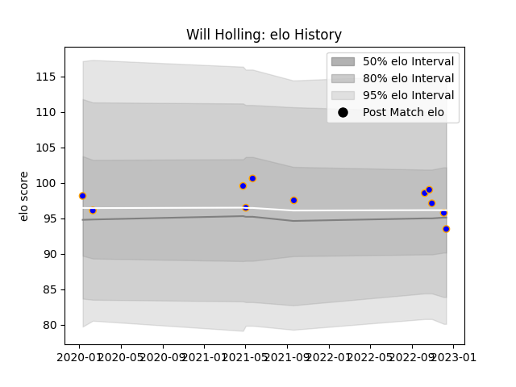

---  
layout: page  
title: Will Holling  
date: 2022-12-18 16:27:25.414816  
categories: player  
---
# Will Holling

## Positions: H

## Current elo: 93.0

## Current Percentile: 58.0

# Elo History

# Match History

| Team      |   Appearances |   Win Rate |
|:----------|--------------:|-----------:|
| Doncaster |            11 |   0.454545 |

| Opponent            |   Matches |   Win Rate |
|:--------------------|----------:|-----------:|
| Bedford             |         2 |          1 |
| Coventry            |         2 |          0 |
| Ampthill            |         1 |          1 |
| Cornish Pirates     |         1 |          0 |
| Ealing Trailfinders |         1 |          0 |
| Jersey              |         1 |          0 |
| London Scottish     |         1 |          1 |
| Newcastle Falcons   |         1 |          0 |
| Richmond            |         1 |          1 |