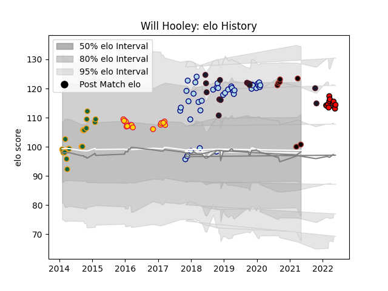

---  
layout: page  
title: Will Hooley  
date: 2023-03-02 11:23:59.295037  
categories: player  
---
# Will Hooley

## Positions: FH, FB

## Country: United States of America

## Current elo: 101.0

## Current Percentile: 92.0

# Elo History

# Match History

| Team                     |   Appearances |   Win Rate |
|:-------------------------|--------------:|-----------:|
| Bedford                  |            38 |   0.657895 |
| Exeter Chiefs            |            21 |   0.571429 |
| Northampton Saints       |            20 |   0.75     |
| United States of America |            13 |   0.461538 |
| San Diego Legion         |            12 |   0.583333 |
| Saracens                 |             7 |   0.714286 |

| Opponent            |   Matches |   Win Rate |
|:--------------------|----------:|-----------:|
| Saracens            |         5 |   0.4      |
| Newcastle Falcons   |         5 |   0.8      |
| Sale Sharks         |         5 |   0.4      |
| Richmond            |         5 |   1        |
| Cornish Pirates     |         5 |   0.4      |
| Hartpury College    |         5 |   0.8      |
| Nottingham          |         5 |   0.8      |
| Doncaster           |         4 |   0.625    |
| London Scottish     |         4 |   0.875    |
| Leicester Tigers    |         4 |   0        |
| Gloucester Rugby    |         4 |   1        |
| Ealing Trailfinders |         3 |   0.333333 |
| Wasps               |         3 |   0.666667 |
| Bristol Rugby       |         3 |   0.333333 |
| London Irish        |         3 |   1        |
| Yorkshire Carnegie  |         3 |   0.666667 |
| Harlequins          |         2 |   0.5      |
| Houston SaberCats   |         2 |   0.5      |
| Clermont Auvergne   |         2 |   0.5      |
| Jersey              |         2 |   1        |
| Canada              |         2 |   1        |
| Dallas Jackals      |         2 |   1        |
| Exeter Chiefs       |         2 |   1        |
| Worcester Warriors  |         2 |   1        |
| Ospreys             |         2 |   1        |
| Bath Rugby          |         2 |   1        |
| L. A. Giltinis      |         2 |   0.5      |
| Russia              |         1 |   1        |
| Samoa               |         1 |   1        |
| Uruguay             |         1 |   0        |
| Scarlets            |         1 |   1        |
| Scotland            |         1 |   1        |
| Tonga               |         1 |   0        |
| Rugby ATL           |         1 |   0        |
| Utah Warriors       |         1 |   1        |
| Rugby New York      |         1 |   0        |
| Ampthill            |         1 |   0        |
| Rotherham Titans    |         1 |   1        |
| Romania             |         1 |   1        |
| R.U. New York       |         1 |   0        |
| Old Glory DC        |         1 |   1        |
| Northampton Saints  |         1 |   0        |
| New Zealand Maori   |         1 |   0        |
| Argentina           |         1 |   0        |
| NOLA Gold           |         1 |   1        |
| Ireland             |         1 |   0        |
| England             |         1 |   0        |
| Coventry            |         1 |   1        |
| Bordeaux Begles     |         1 |   0        |
| New Zealand         |         1 |   0        |